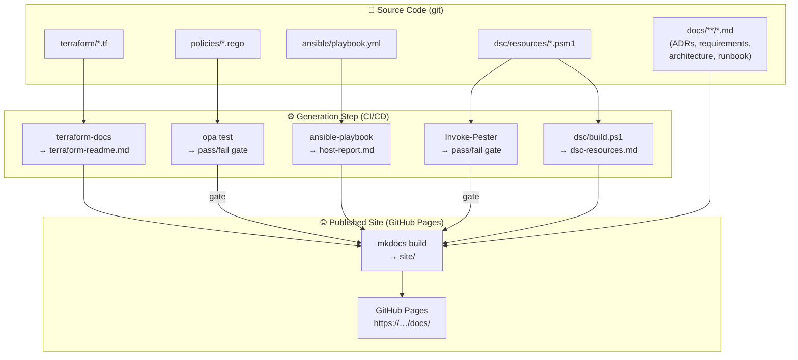

# Architecture Overview

This page captures the **architecture of the deterministic documentation
platform** using C4-style diagrams.  All diagrams are rendered from Mermaid
source embedded directly in Markdown — no diagramming tool or export step is
required.

!!! info "Architectural decision"
    See [ADR-0005](../adrs/0005-architecture-documentation.md) for the
    rationale behind embedding diagrams in Markdown rather than exporting
    from a diagramming tool.

---

## C4 Level 1 — System Context

The context diagram shows **who interacts with the platform** and **what
external systems it depends on**.

```mermaid
C4Context
    title System Context — Deterministic Documentation Platform

    Person(architect,    "Architect",    "Authors ADRs, requirements,\narchitecture docs")
    Person(devops,       "DevOps",       "Manages IaC, pipelines,\nconfiguration and runbooks")
    Person(cybersec,     "Security",     "Authors OPA policies,\nreviews compliance reports")
    Person(developer,    "Developer",    "Consumes docs via Backstage\nor MkDocs site")

    System(platform, "Deterministic Documentation Platform",
           "Auto-generates and publishes documentation\nfrom source code artefacts")

    System_Ext(github,    "GitHub",           "Source control + Actions CI/CD")
    System_Ext(pages,     "GitHub Pages",     "Hosts the published MkDocs site")
    System_Ext(backstage, "Backstage",        "Developer portal — TechDocs integration")
    System_Ext(registry,  "Container Registry", "Stores toolchain Docker images")

    Rel(architect,  platform, "Writes ADRs, requirements,\narchitecture Markdown")
    Rel(devops,     platform, "Writes Terraform, Ansible,\nDSC, pipeline config")
    Rel(cybersec,   platform, "Writes OPA policies,\nreviews compliance output")
    Rel(developer,  backstage,"Discovers services\nand reads documentation")
    Rel(developer,  pages,    "Reads generated\ndoc site")

    Rel(platform, github,    "Triggered by push/PR;\ndeploys site artefact")
    Rel(platform, pages,     "Publishes MkDocs site")
    Rel(platform, backstage, "Registered via\ncatalog-info.yaml")
    Rel(platform, registry,  "Pushes toolchain image")
```

---

## C4 Level 2 — Container Diagram

The container diagram shows **how the platform is decomposed into deployable
units**.

```mermaid
C4Container
    title Container Diagram — Deterministic Documentation Platform

    Person(devops,   "DevOps / Architect / Security",  "Platform contributor")
    Person(consumer, "Developer / Stakeholder",         "Documentation consumer")

    System_Boundary(platform, "Deterministic Documentation Platform") {
        Container(toolchain, "Toolchain Image",
                  "Docker (debian:12-slim + Python 3.12 + pwsh)",
                  "Runs the full doc-gen pipeline locally or in CI")

        Container(pipeline,  "CI/CD Pipeline",
                  "GitHub Actions",
                  "Orchestrates OPA gates, Pester, terraform-docs,\nAnsible, DSC build, MkDocs build, Pages deploy")

        Container(site,      "MkDocs Site",
                  "MkDocs Material — static HTML",
                  "Published to GitHub Pages on every merge to main")

        Container(portal,    "Backstage Image",
                  "Docker (Node.js + @backstage/create-app)",
                  "Self-contained Backstage developer portal\nserving TechDocs on port 7007")
    }

    System_Ext(github,    "GitHub",       "Source control + Actions")
    System_Ext(pages,     "GitHub Pages", "Static site hosting")

    Rel(devops,    toolchain, "docker run dtds-example\nscripts/generate-docs.sh")
    Rel(devops,    pipeline,  "git push / pull request")
    Rel(pipeline,  toolchain, "Uses image or\ninstalls tools directly")
    Rel(pipeline,  site,      "mkdocs build + deploy")
    Rel(pipeline,  pages,     "actions/deploy-pages")
    Rel(consumer,  site,      "HTTPS browse")
    Rel(consumer,  portal,    "docker run dtds-backstage\n(port 7007)")
    Rel(portal,    site,      "TechDocs renders\nMkDocs output")
    Rel(toolchain, github,    "git commit generated docs")
```

---

## C4 Level 3 — Component Diagram (CI/CD Pipeline)

This diagram shows the **individual jobs and steps** inside the GitHub Actions
pipeline, which is the runtime core of the platform.

```mermaid
C4Component
    title Component Diagram — CI/CD Pipeline internals

    Container_Boundary(pipeline, "GitHub Actions Pipeline") {
        Component(opajob,   "opa-tests job",    "bash + OPA CLI",
                            "opa test policies/ — 100% rule coverage gate")
        Component(dscjob,   "dsc-tests job",    "pwsh + Pester 5",
                            "Invoke-Pester dsc/tests/ — Get/Test/Set coverage")
        Component(tfjob,    "terraform job",    "Terraform + OPA CLI",
                            "init → validate → plan-json → OPA compliance gate")
        Component(docsjob,  "docs-build job",   "Python + pwsh + Ansible",
                            "terraform-docs + dsc/build.ps1 + Ansible + mkdocs build")
        Component(deployjob,"docs-publish job", "actions/deploy-pages",
                            "Deploy site/ artefact to GitHub Pages (main only)")
    }

    Rel(opajob,    tfjob,    "needs: opa-tests")
    Rel(dscjob,    docsjob,  "needs: dsc-tests")
    Rel(tfjob,     docsjob,  "needs: terraform")
    Rel(docsjob,   deployjob,"needs: docs-build")
```

---

## Data Flow — Documentation Artefact Lifecycle



---

## Technology Radar

The table below is the platform's internal **technology radar** — every tool
is recorded here so architects can assess adoption risk and plan upgrades.

| Technology | Ring | Category | Description |
|------------|------|----------|-------------|
| Terraform 1.9 | **Adopt** | IaC | Industry-standard HCL-based IaC |
| OPA / Rego 0.69 | **Adopt** | Policy-as-Code | Declarative policy engine with `__rego__metadoc__` |
| MkDocs Material 9.5 | **Adopt** | Documentation | Static site generator with Mermaid support |
| terraform-docs 0.19 | **Adopt** | Doc Generation | Auto-generates HCL input/output tables |
| Pester 5 | **Adopt** | Testing | PowerShell unit/integration test framework |
| PowerShell DSC | **Adopt** | Config Management | Class-based resources for Windows workloads |
| Ansible 10.7 | **Trial** | Config Management | Agentless Linux configuration management |
| Backstage | **Trial** | Developer Portal | Centralised service catalogue + TechDocs |
| DscResource.DocGenerator | **Trial** | Doc Generation | Community module — lags behind PowerShell releases |
| GitHub Actions | **Adopt** | CI/CD | Native GitHub CI/CD with reusable actions |
| Mermaid (embedded) | **Adopt** | Diagramming | Diagram-as-code, rendered by MkDocs Material |
| IriusRisk | **Assess** | Threat Modelling | Automated threat model from Terraform — paid licence |
| Infragram / C4-Terraform | **Assess** | Architecture | Auto C4 diagrams from `.tfstate` — tooling immature |
| Grafana Cloud SLO | **Assess** | Observability | SLO resources as Terraform — requires paid Grafana Cloud |

> **Ring definitions:** **Adopt** — use in production; **Trial** — use in new
> projects with caution; **Assess** — evaluate in spike; **Hold** — avoid for
> new work.

---

## Quality Attribute Scenarios

The following table captures the key quality attributes the platform must satisfy,
following the *architect's perspective* from ISO 25010.

| ID | Quality Attribute | Scenario | Satisfied By |
|----|------------------|---------|-------------|
| QA-001 | **Maintainability** | A new tool is added to the stack — docs must update without human writing | Auto-generation via terraform-docs, DSC DocGenerator |
| QA-002 | **Traceability** | An auditor asks which requirement drove which OPA policy | `related_requirements` in `__rego__metadoc__`; traceability page |
| QA-003 | **Security** | A Terraform PR introduces a publicly exposed resource — pipeline must block it | OPA gate in CI (SEC-002, SEC-003 policies) |
| QA-004 | **Portability** | A new team member must run the pipeline with zero local installs | Single `docker run dtds-example` command |
| QA-005 | **Discoverability** | A developer must find documentation without asking a human | Backstage TechDocs integration + MkDocs search |
| QA-006 | **Compliance** | An auditor asks which CIS benchmark controls are enforced | Security controls matrix in `docs/security/index.md` |
| QA-007 | **Operability** | An on-call engineer must diagnose and resolve a pipeline failure | Operational runbook in `docs/runbook/index.md` |
