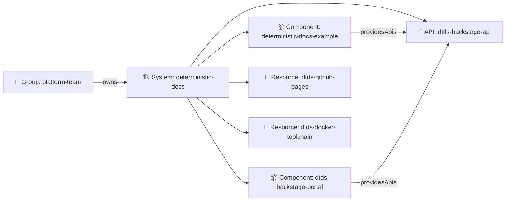
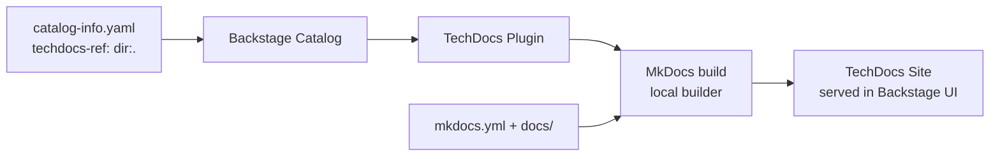
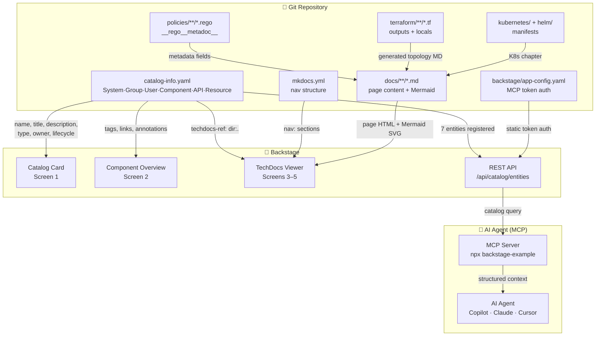

# Backstage Integration

[Backstage](https://backstage.io) is the open-source developer portal platform
used to consolidate all service catalogues, documentation (TechDocs), and
engineering tooling into a single, searchable interface.

This example ships with a complete Backstage integration so the deterministic
documentation pipeline output is discoverable inside your organisation's
developer portal — and queryable by AI agents via the **Model Context Protocol
(MCP)**.

---

## Integration Files

| File | Purpose |
|------|---------|
| `catalog-info.yaml` | Multi-document entity registry (System, Group, User, Component × 2, API, Resource × 2) |
| `backstage/app-config.yaml` | Backstage application configuration (GitHub integration, TechDocs, catalog, MCP token auth) |
| `Dockerfile.backstage` | Standalone Backstage Docker image with TechDocs support |
| `.vscode/mcp.json` | VS Code / GitHub Copilot MCP server configuration (committed, works out of the box) |
| `backstage/mcp-clients/` | Per-client MCP config snippets (Claude Desktop, Cursor) |

!!! tip "AI-Ready Catalog"
    The Backstage catalog is now queryable by AI agents via MCP.
    See **[Backstage MCP Server](mcp.md)** for full setup instructions and example AI conversations.

---

## Catalog Entity Hierarchy

The `catalog-info.yaml` registers **seven entities** covering the full system:



---

## How TechDocs Works

Backstage's **TechDocs** feature reads the `backstage.io/techdocs-ref` annotation
from `catalog-info.yaml`, finds the `mkdocs.yml` in the referenced path, builds
the site using MkDocs, and serves it inside the Backstage UI.



The annotation in `catalog-info.yaml`:

```yaml
annotations:
  backstage.io/techdocs-ref: dir:.
```

The `dir:.` value tells TechDocs to look for `mkdocs.yml` in the same directory
as the `catalog-info.yaml` file (the `example/` directory).

---

## Quick Start — Docker

Build and run the standalone Backstage image:

```bash
# Build (takes ~8-12 minutes — downloads Node.js dependencies)
docker build -f example/Dockerfile.backstage -t dtds-backstage example/

# Run the portal (MCP token enables AI agent access)
docker run --rm -p 7007:7007 \
  -e BACKSTAGE_MCP_TOKEN=dtds-mcp-demo-token-change-in-production \
  -e GITHUB_TOKEN=<your-github-token> \
  dtds-backstage
```

Then open [http://localhost:7007](http://localhost:7007).

You will see:

- **Catalog** → 7 entities: the System, Group, User, 2 Components, 1 API, and 2 Resources
- **Docs** tab → TechDocs site with all documentation pages, ADRs, compliance summary, and traceability matrix

!!! tip "AI Agent Access"
    With the `BACKSTAGE_MCP_TOKEN` set, AI agents (Copilot, Claude, Cursor) can
    immediately query the catalog via MCP.  See [Backstage MCP Server](mcp.md)
    for client setup instructions.

!!! tip "GitHub token is optional"
    Without `GITHUB_TOKEN` the catalog still loads from the local filesystem
    copy bundled in the image.  The token is only needed for live repository
    access and higher API rate limits.

---

## Integrating with an Existing Backstage Instance

If you already run Backstage in your organisation, register the component by
adding the following to your `app-config.yaml`:

```yaml
catalog:
  locations:
    - type: url
      target: https://github.com/DevelApp-ai/deterministic-technical-design-specification/blob/main/example/catalog-info.yaml
      rules:
        - allow: [Component]
```

Then enable the TechDocs local builder (or configure an S3/GCS publisher for
production):

```yaml
techdocs:
  builder: local
  generator:
    runIn: local
  publisher:
    type: local
```

---

## catalog-info.yaml Anatomy

```yaml
apiVersion: backstage.io/v1alpha1
kind: Component
metadata:
  name: deterministic-docs-example
  annotations:
    # Points TechDocs to the mkdocs.yml in the example/ directory
    backstage.io/techdocs-ref: dir:.
    # Links Backstage to the GitHub repository
    github.com/project-slug: DevelApp-ai/deterministic-technical-design-specification
  tags:
    - terraform
    - opa
    - documentation
spec:
  type: documentation
  lifecycle: experimental
  owner: platform-team
```

The key annotation is `backstage.io/techdocs-ref: dir:.` — this is the only
change needed to make any MkDocs-based documentation site discoverable in
Backstage's TechDocs.

---

## MkDocs Configuration for TechDocs

Backstage TechDocs requires no changes to `mkdocs.yml` beyond using the
Material theme.  All standard MkDocs features — navigation, Mermaid diagrams,
search — render correctly in the TechDocs iframe.

---

## Backstage UI — Annotated Wireframes

The wireframes below show what each Backstage screen looks like once the
`catalog-info.yaml` from this repository is registered.  All data comes
directly from the files in this repo — no manual entry is required.

### Screen 1 — Software Catalog home

The Catalog lists every registered entity.  The `deterministic-docs-example`
component appears as a card with its title, description, type, owner, and tags,
all sourced from `catalog-info.yaml`.

```
┌─────────────────────────────────────────────────────────────────────────────┐
│  🎵  Backstage                         Search…                👤 platform-team│
├──────────┬──────────────────────────────────────────────────────────────────┤
│ Catalog  │  Software Catalog                                                 │
│ TechDocs │                                                                   │
│ APIs     │  Filters                  Components (1)                          │
│ GraphiQL │  ─────────────────────    ──────────────────────────────────────  │
│          │  Kind                     ┌──────────────────────────────────────┐│
│          │  ● Component (1)          │ 📄 deterministic-docs-example        ││
│          │                           │    Deterministic Technical Design     ││
│          │  Type                     │    Specification                      ││
│          │  ● documentation (1)      │                                       ││
│          │                           │    A working example of the           ││
│          │  Lifecycle                │    deterministic documentation        ││
│          │  ● experimental (1)       │    pipeline. IaC + Policy as Code     ││
│          │                           │    + Documentation as Code.           ││
│          │  Owner                    │                                       ││
│          │  ● platform-team (1)      │    Type: documentation                ││
│          │                           │    Owner: platform-team               ││
│          │  Tags                     │    Lifecycle: experimental            ││
│          │  ○ terraform              │                                       ││
│          │  ○ opa                    │    🏷 terraform  opa  documentation   ││
│          │  ○ documentation          │       infrastructure-as-code  mkdocs  ││
│          │  ○ infrastructure-as-code │                                       ││
│          │  ○ policy-as-code         │    [ VIEW COMPONENT → ]               ││
│          │  ○ mkdocs                 └──────────────────────────────────────┘│
└──────────┴──────────────────────────────────────────────────────────────────┘
```

---

### Screen 2 — Component overview page

Clicking **VIEW COMPONENT** opens the component page.  The sidebar tabs and
the "About" card are all populated from `catalog-info.yaml`.

```
┌─────────────────────────────────────────────────────────────────────────────┐
│  🎵  Backstage                         Search…                👤 platform-team│
├─────────────────────────────────────────────────────────────────────────────┤
│  < Catalog / deterministic-docs-example                                      │
│                                                                               │
│  📄 Deterministic Technical Design Specification           experimental       │
│     documentation · owned by platform-team · system: deterministic-docs      │
│                                                                               │
│  [ Overview ] [ Docs ] [ CI/CD ] [ Dependencies ]                            │
├───────────────────────────────┬─────────────────────────────────────────────┤
│  About                        │  Links                                       │
│  ─────────────────────────    │  ──────────────────────────                  │
│  Description:                 │  🐙 GitHub Repository                        │
│    A working example of the   │     github.com/DevelApp-ai/deterministic-…   │
│    deterministic documentation│                                              │
│    pipeline. IaC + Policy as  │  📄 Published Documentation                  │
│    Code + Docs as Code.       │     DevelApp-ai.github.io/deterministic-…    │
│                               │                                              │
│  Owner:  platform-team        ├─────────────────────────────────────────────┤
│  Type:   documentation        │  Tags                                        │
│  System: deterministic-docs   │  ──────────────────────────                  │
│  Lifecycle: experimental      │  terraform   opa   documentation             │
│                               │  infrastructure-as-code   policy-as-code     │
│                               │  mkdocs                                      │
│                               ├─────────────────────────────────────────────┤
│                               │  Relations                                   │
│                               │  ──────────────────────────                  │
│                               │  partOf  ›  deterministic-docs (system)      │
└───────────────────────────────┴─────────────────────────────────────────────┘
```

---

### Screen 3 — TechDocs tab (documentation root)

Clicking the **Docs** tab loads the TechDocs viewer.  Backstage builds the
MkDocs site on demand and renders it inside the portal frame.  The left-hand
navigation mirrors the `nav:` section of `mkdocs.yml`.

```
┌─────────────────────────────────────────────────────────────────────────────┐
│  🎵  Backstage                         Search…                👤 platform-team│
├─────────────────────────────────────────────────────────────────────────────┤
│  < Catalog / deterministic-docs-example                                      │
│  [ Overview ] [ Docs ✓ ] [ CI/CD ] [ Dependencies ]                         │
├───────────────────────┬─────────────────────────────────────────────────────┤
│  Navigation           │  Deterministic Technical Design Specification        │
│  ─────────────────    │  ════════════════════════════════════════════════    │
│  ▼ Home               │                                                      │
│  ▶ Requirements       │  Welcome to the deterministic documentation          │
│     MoSCoW            │  pipeline example.                                   │
│  ▶ Architecture       │                                                      │
│     Overview & C4     │  This site is auto-generated from source control.    │
│  ▶ Infrastructure     │  Every page, diagram, and compliance entry is        │
│     Terraform Module  │  derived directly from infrastructure code,          │
│     Network Topology  │  policy files, and structured metadata.              │
│  ▶ Configuration      │                                                      │
│     Ansible           │  ┌─────────────────────────────────────────────┐     │
│     DSC Resources     │  │ Key Capabilities                            │     │
│  ▶ Compliance         │  │ ✔ Infrastructure as Code  (Terraform)       │     │
│     OPA Policies      │  │ ✔ Policy as Code          (OPA/Rego)        │     │
│     Security Controls │  │ ✔ Config as Code          (Ansible + DSC)   │     │
│  ▶ Architecture       │  │ ✔ Documentation as Code   (MkDocs)          │     │
│     Decisions         │  │ ✔ Traceability            (Req→ADR→Policy)  │     │
│     ADR-0001          │  │ ✔ Developer Portal        (Backstage)        │     │
│     ADR-0002          │  └─────────────────────────────────────────────┘     │
│     ADR-0003          │                                                      │
│     ADR-0004          │  [  Requirements →  ]  [  Architecture →  ]          │
│     ADR-0005          │                                                      │
│  ▶ Traceability       │                                                      │
│  ▶ Backstage          │                                                      │
│  ▶ Operations         │                                                      │
│  ▶ Generated          │                                                      │
└───────────────────────┴─────────────────────────────────────────────────────┘
```

---

### Screen 4 — TechDocs: Traceability page

The traceability page renders interactive Mermaid diagrams inside the
TechDocs viewer, showing the live requirement → ADR → policy chain.

```
┌─────────────────────────────────────────────────────────────────────────────┐
│  🎵  Backstage                 🔍 Search docs…               👤 platform-team│
├───────────────────────┬─────────────────────────────────────────────────────┤
│  Navigation           │  Requirements → ADRs → Policies                      │
│  ─────────────────    │  ═════════════════════════════════                   │
│  ▼ Traceability       │                                                      │
│    Req→ADR→Policy ✓   │  Full Traceability Graph                             │
│                       │  ───────────────────────                             │
│                       │                                                      │
│                       │  ┌────────────────────────────────────────────────┐ │
│                       │  │ [Mermaid diagram rendered]                     │ │
│                       │  │                                                │ │
│                       │  │  M-001─►ADR-0001─►deny_public_access          │ │
│                       │  │  M-002─►ADR-0002─►deny_public_access          │ │
│                       │  │  M-003─►ADR-0001─►deny_unrestricted_net       │ │
│                       │  │  S-001─►ADR-0002─►deny_resource_tags          │ │
│                       │  │  S-008─►ADR-0004─►DSC/DTDS_FileContent        │ │
│                       │  │  S-009─►ADR-0004─►DSC/DscConfiguration        │ │
│                       │  │                                                │ │
│                       │  └────────────────────────────────────────────────┘ │
│                       │                                                      │
│                       │  Coverage Pie Chart                                  │
│                       │  ─────────────────                                   │
│                       │  ┌────────────────────────────────────────────────┐ │
│                       │  │ [Mermaid pie rendered]                         │ │
│                       │  │  Implemented  ████████████████ 75%             │ │
│                       │  │  Covered      ████████         38%             │ │
│                       │  │  Untested     ████             18%             │ │
│                       │  └────────────────────────────────────────────────┘ │
└───────────────────────┴─────────────────────────────────────────────────────┘
```

---

### Screen 5 — TechDocs: Security Controls Matrix

The security page surfaces the CIS/NIST/SOC 2 controls table directly in the
Backstage docs viewer — auditors and security engineers can read it without
leaving the portal.

```
┌─────────────────────────────────────────────────────────────────────────────┐
│  🎵  Backstage                 🔍 Search docs…               👤 platform-team│
├───────────────────────┬─────────────────────────────────────────────────────┤
│  Navigation           │  Security Controls Matrix                            │
│  ─────────────────    │  ════════════════════════                            │
│  ▼ Compliance         │                                                      │
│    OPA Policies       │  ┌───────────────┬──────────┬──────────┬──────────┐ │
│    Security ✓         │  │ Control       │ CIS      │ NIST     │ SOC 2    │ │
│                       │  ├───────────────┼──────────┼──────────┼──────────┤ │
│                       │  │ deny_public_  │ CIS 2.1  │ AC-3     │ CC6.1    │ │
│                       │  │ access        │ CIS 5.4  │ SC-7     │ CC6.6    │ │
│                       │  ├───────────────┼──────────┼──────────┼──────────┤ │
│                       │  │ deny_resource │ CIS 1.1  │ CM-8     │ CC7.1    │ │
│                       │  │ _tags         │ CIS 1.5  │ CM-12    │ CC7.2    │ │
│                       │  ├───────────────┼──────────┼──────────┼──────────┤ │
│                       │  │ deny_unencry  │ CIS 2.3  │ SC-28    │ CC6.7    │ │
│                       │  │ pted_storage  │ CIS 2.7  │ SC-13    │          │ │
│                       │  ├───────────────┼──────────┼──────────┼──────────┤ │
│                       │  │ deny_unrestri │ CIS 5.2  │ SC-7     │ CC6.6    │ │
│                       │  │ cted_network  │ CIS 5.3  │ SI-3     │ CC7.1    │ │
│                       │  └───────────────┴──────────┴──────────┴──────────┘ │
│                       │                                                      │
│                       │  All controls are enforced automatically in CI/CD.  │
└───────────────────────┴─────────────────────────────────────────────────────┘
```

---

### Data flow — from source to UI and MCP

The diagram below shows how content travels from this repository into each panel
of the Backstage UI and to AI agents via MCP.


