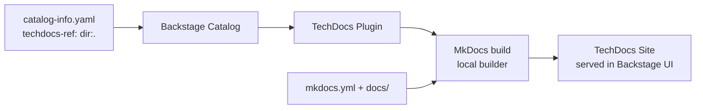

# Backstage Integration

[Backstage](https://backstage.io) is the open-source developer portal platform
used to consolidate all service catalogues, documentation (TechDocs), and
engineering tooling into a single, searchable interface.

This example ships with a complete Backstage integration so the deterministic
documentation pipeline output is discoverable inside your organisation's
developer portal.

---

## Integration Files

| File | Purpose |
|------|---------|
| `catalog-info.yaml` | Backstage entity descriptor — registers the component and points to TechDocs |
| `backstage/app-config.yaml` | Backstage application configuration (GitHub integration, TechDocs, catalog) |
| `Dockerfile.backstage` | Standalone Backstage Docker image with TechDocs support |

---

## How TechDocs Works

Backstage's **TechDocs** feature reads the `backstage.io/techdocs-ref` annotation
from `catalog-info.yaml`, finds the `mkdocs.yml` in the referenced path, builds
the site using MkDocs, and serves it inside the Backstage UI.



The annotation in `catalog-info.yaml`:

```yaml
annotations:
  backstage.io/techdocs-ref: dir:.
```

The `dir:.` value tells TechDocs to look for `mkdocs.yml` in the same directory
as the `catalog-info.yaml` file (the `example/` directory).

---

## Quick Start — Docker

Build and run the standalone Backstage image:

```bash
# Build (takes ~8-12 minutes — downloads Node.js dependencies)
docker build -f example/Dockerfile.backstage -t dtds-backstage example/

# Run the portal
docker run --rm -p 7007:7007 \
  -e GITHUB_TOKEN=<your-github-token> \
  dtds-backstage
```

Then open [http://localhost:7007](http://localhost:7007).

You will see:

- **Catalog** → `deterministic-docs-example` component registered
- **Docs** tab → TechDocs site with all documentation pages, ADRs, compliance summary, and traceability matrix

!!! tip "GitHub token is optional"
    Without `GITHUB_TOKEN` the catalog still loads from the local filesystem
    copy bundled in the image.  The token is only needed for live repository
    access and higher API rate limits.

---

## Integrating with an Existing Backstage Instance

If you already run Backstage in your organisation, register the component by
adding the following to your `app-config.yaml`:

```yaml
catalog:
  locations:
    - type: url
      target: https://github.com/DevelApp-ai/deterministic-technical-design-specification/blob/main/example/catalog-info.yaml
      rules:
        - allow: [Component]
```

Then enable the TechDocs local builder (or configure an S3/GCS publisher for
production):

```yaml
techdocs:
  builder: local
  generator:
    runIn: local
  publisher:
    type: local
```

---

## catalog-info.yaml Anatomy

```yaml
apiVersion: backstage.io/v1alpha1
kind: Component
metadata:
  name: deterministic-docs-example
  annotations:
    # Points TechDocs to the mkdocs.yml in the example/ directory
    backstage.io/techdocs-ref: dir:.
    # Links Backstage to the GitHub repository
    github.com/project-slug: DevelApp-ai/deterministic-technical-design-specification
  tags:
    - terraform
    - opa
    - documentation
spec:
  type: documentation
  lifecycle: experimental
  owner: platform-team
```

The key annotation is `backstage.io/techdocs-ref: dir:.` — this is the only
change needed to make any MkDocs-based documentation site discoverable in
Backstage's TechDocs.

---

## MkDocs Configuration for TechDocs

Backstage TechDocs requires no changes to `mkdocs.yml` beyond using the
Material theme.  All standard MkDocs features — navigation, Mermaid diagrams,
search — render correctly in the TechDocs iframe.
