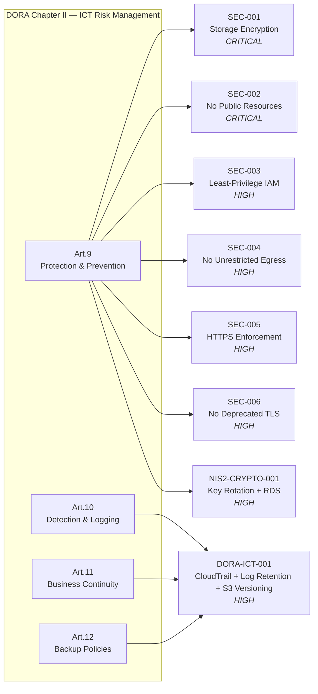

# EU DORA Compliance — Digital Operational Resilience Act Evidence

!!! info "Regulation Reference"
    **EU Regulation 2022/2554 (DORA)** — Digital Operational Resilience Act.
    Directly applicable to financial entities and critical ICT third-party
    service providers from **17 January 2025**.
    See [ADR-0011](../adrs/0011-dora-compliance.md) for the compliance strategy decision.

!!! tip "Relationship to NIS2"
    DORA is *lex specialis* over NIS2 for financial entities — where both
    frameworks apply, DORA takes precedence. Controls already evidenced for
    [NIS2](nis2.md) are credited here where they also satisfy DORA obligations.

This page is the **single-page evidence summary** for DORA supervisory audits.
Every control links to a traceable, version-controlled artefact so that
regulators (ECB SSM, national competent authorities) can verify current state
without manual attestation.

**Legend:**
- ✅ **Automated** — enforced by an OPA policy that blocks the CI/CD pipeline
- 📋 **Documented** — evidenced by a version-controlled document or configuration file
- ⚠️ **Partial** — coverage exists but gaps remain (see gap column)
- ❌ **Gap** — not yet implemented (roadmap item)

---

## DORA Chapter Overview — Control Matrix

| Chapter | Pillar | Articles | Status | Key Evidence |
|---------|--------|----------|--------|-------------|
| II | ICT Risk Management | 5–16 | ✅ + 📋 | DORA-ICT-001 policy, ADR-0011, OPA gate |
| III | ICT Incident Management & Reporting | 17–23 | 📋 | Runbook, monitoring alarms, Ansible compliance check |
| IV | Digital Operational Resilience Testing | 24–27 | ⚠️ Partial | OPA unit tests (90/90), Pester DSC tests, doc coverage gate |
| V | ICT Third-Party Risk Management | 28–44 | ⚠️ Partial | Local provider scoping (W-001) |
| VI | Information Sharing Arrangements | 45 | ❌ Gap | Voluntary; outside repo scope |

---

## Chapter II — ICT Risk Management (Art. 5–16)

### Art.5–6 — Governance and ICT Risk Management Framework

**Requirement:** The management body must define, approve, and oversee the
ICT risk management framework and be accountable for its implementation.

**Evidence:**

| Artefact | Type | Link | Description |
|---------|------|------|-------------|
| MoSCoW Requirements | Policy document | [requirements/moscow.md](../requirements/moscow.md) | Prioritised ICT risk requirements with DORA-specific section |
| ADR index | Architecture decisions | [adrs/](../adrs/0001-use-terraform-for-iac.md) | 11 ADRs documenting every significant design decision |
| ADR-0011 | Architecture decision | [adrs/0011](../adrs/0011-dora-compliance.md) | DORA compliance strategy — management-level decision record |
| Traceability matrix | Bidirectional map | [traceability/index.md](../traceability/index.md) | Requirement → ADR → Policy → Implementation chain |

**Audit checkpoint:** Every ADR is version-controlled; the git history proves
when each risk-management decision was made and by which team.

---

### Art.9 — Protection and Prevention

**Requirement:** Financial entities shall have in place ICT security policies,
procedures, protocols and tools to protect all ICT assets including data at rest
and in transit.

**Evidence:**

| Policy | ID | Severity | DORA Article | Description |
|--------|-----|---------|-------------|-------------|
| Storage Encryption | [SEC-001](opa-policies.md#sec-001) | CRITICAL | Art.9 | Blocks unencrypted EBS/S3/Azure Storage |
| No Public Resources | [SEC-002](opa-policies.md#sec-002) | CRITICAL | Art.9 | Blocks publicly exposed resources |
| Least-Privilege IAM | [SEC-003](opa-policies.md#sec-003) | HIGH | Art.9 | Blocks wildcard IAM principals/actions |
| No Unrestricted Egress | [SEC-004](opa-policies.md#sec-004) | HIGH | Art.9 | Blocks unrestricted network egress |
| HTTPS Enforcement | [SEC-005](opa-policies.md#sec-005) | HIGH | Art.9 | Blocks HTTP without HTTPS redirect |
| No Deprecated TLS | [SEC-006](opa-policies.md#sec-006) | HIGH | Art.9 | Blocks TLS 1.0/1.1 endpoints |
| KMS Rotation + RDS + Secrets | [NIS2-CRYPTO-001](opa-policies.md#nis2-crypto-001) | HIGH | Art.9 | Blocks disabled KMS rotation, unencrypted RDS, plaintext secrets |

All seven policies run as a hard gate in CI/CD — `terraform apply` is blocked
until all `deny` sets are empty.

---

### Art.10 — Detection

**Requirement:** Financial entities shall have in place mechanisms to detect
anomalous activities, including ICT network performance issues and ICT-related
incidents promptly.

**Evidence:**

| Artefact | Type | Link | Description |
|---------|------|------|-------------|
| `terraform/monitoring.tf` | IaC | [infrastructure/terraform.md](../infrastructure/terraform.md) | CloudWatch alarms: CPU, error rate, latency, disk |
| DORA-ICT-001 (CloudTrail validation) | OPA policy | [opa-policies.md#dora-ict-001](opa-policies.md#dora-ict-001) | Blocks CloudTrail without log-file integrity validation |
| DORA-ICT-001 (log retention) | OPA policy | [opa-policies.md#dora-ict-001](opa-policies.md#dora-ict-001) | Blocks CloudWatch log groups without explicit retention |
| `ansible/compliance_check.yml` | Automation | [configuration/ansible.md](../configuration/ansible.md) | Continuous host-level compliance verification |

**Log retention minimum by DORA:**  
DORA mandates log retention of **at least 12 months** (Art.10(1)).  The
`DORA-ICT-001` policy enforces that a non-zero retention period is set; teams
must additionally ensure `retention_in_days >= 365` for production log groups.

---

### Art.11 — Response and Recovery — Business Continuity

**Requirement:** Financial entities shall have in place a dedicated and
comprehensive ICT business continuity policy.

**Evidence:**

| Artefact | Type | Link | Description |
|---------|------|------|-------------|
| `terraform/storage.tf` | IaC | [infrastructure/terraform.md](../infrastructure/terraform.md) | S3 backup bucket with cross-region replication |
| DORA-ICT-001 (S3 versioning) | OPA policy | [opa-policies.md#dora-ict-001](opa-policies.md#dora-ict-001) | Blocks S3 buckets without versioning (point-in-time recovery prerequisite) |
| `terraform/monitoring.tf` | IaC | [infrastructure/terraform.md](../infrastructure/terraform.md) | Alarms on CPU, error rate, disk with PagerDuty/Slack channels |
| Runbook | Procedure | [runbook/index.md](../runbook/index.md) | Incident response flowchart, escalation matrix, recovery steps |

**Gap:** Formal RTO (Recovery Time Objective) and RPO (Recovery Point Objective)
targets are not yet documented. Add to `docs/runbook/index.md`.

---

### Art.12 — Backup Policies and Procedures

**Requirement:** Financial entities shall have in place backup policies and
procedures specifying the scope of data to be backed up, minimum frequency, and
methods for data restoration.

**Evidence:**

| Artefact | Type | Link | Description |
|---------|------|------|-------------|
| DORA-ICT-001 (S3 versioning) | OPA policy | [opa-policies.md#dora-ict-001](opa-policies.md#dora-ict-001) | S3 bucket versioning enforced — prerequisite for point-in-time recovery |
| NIS2-CRYPTO-001 (RDS encryption) | OPA policy | [opa-policies.md#nis2-crypto-001](opa-policies.md#nis2-crypto-001) | RDS encrypted at rest (backup integrity) |
| `terraform/storage.tf` | IaC | [infrastructure/terraform.md](../infrastructure/terraform.md) | Non-current object expiration policy; cross-region replication |

**Gap:** Backup restoration testing procedure and minimum backup frequency
policy are not yet formally documented. Add a backup runbook section.

---

### Art.13–14 — Learning and Evolving / Communication

**Requirement:** Financial entities shall have in place capabilities and
procedures for ICT-related incident classification, reporting, and learning.

**Evidence:**

| Artefact | Type | Link | Description |
|---------|------|------|-------------|
| OPA unit tests (90/90) | Automated | [opa-policies.md](opa-policies.md) | Policy correctness verified by 90 tests on every PR |
| Doc coverage gate | Automated | [doc-review/index.md](../doc-review/index.md) | Infrastructure changes without docs fail CI |
| Gap analysis (this page) | Manual review | [DORA Gap Analysis](#gap-analysis) | Living roadmap reviewed each release |
| Runbook | Procedure | [runbook/index.md](../runbook/index.md) | Lessons-learned section after each incident |

---

## Chapter III — ICT Incident Management (Art. 17–23)

### Art.17 — ICT-Related Incident Management Process

**Requirement:** Financial entities shall define, establish, and implement an
ICT-related incident management process to detect, manage, and notify of
ICT-related incidents.

**Evidence:**

| Artefact | Type | Link | Description |
|---------|------|------|-------------|
| Runbook — Incident Response | Procedure | [runbook/index.md](../runbook/index.md) | Detect → manage → notify flowchart, escalation matrix |
| CloudWatch alarms | Automated detection | [infrastructure/terraform.md](../infrastructure/terraform.md) | CPU, error rate, latency alarms feed PagerDuty/Slack |
| Ansible compliance check | Automated scan | [configuration/ansible.md](../configuration/ansible.md) | Continuous host-level compliance scanning |

---

### Art.19–20 — Classification and Reporting of Major Incidents

**Requirement:** Financial entities shall classify ICT-related incidents and
report major incidents to the relevant competent authority without undue delay
(initial: 4h; intermediate: 72h; final: 1 month after resolution).

**Evidence:**

| Artefact | Type | Link | Description |
|---------|------|------|-------------|
| Runbook — Escalation Matrix | Procedure | [runbook/index.md](../runbook/index.md) | Severity classification, contact list, notification SLAs |

**Gap:** DORA Art.20 incident classification thresholds (number of affected
clients, geographic spread, economic impact) are not yet formally documented.
Add a DORA incident classification matrix to the runbook.

---

### Art.23 — Voluntary Notification of Significant Cyber Threats

**Requirement:** Financial entities may voluntarily notify the competent
authority of significant cyber threats.

**Evidence:** Procedure covered implicitly by the runbook escalation matrix.
No automated enforcement is feasible for this article.

---

## Chapter IV — Digital Operational Resilience Testing (Art. 24–27)

### Art.24–25 — Testing Programme and Advanced Testing (TLPT)

**Requirement:** Financial entities shall establish, maintain, and review a
sound and comprehensive digital operational resilience testing programme.
Significant entities must undergo Threat Led Penetration Testing (TLPT) at
least every three years.

**Evidence:**

| Artefact | Type | Metric | Link |
|---------|------|--------|------|
| OPA unit tests | Automated | 90/90 pass | [opa-policies.md](opa-policies.md) |
| Pester DSC tests | Automated | Pester 5 test suite | [dsc/index.md](../dsc/index.md) |
| Doc coverage gate | Automated | CI gate on every PR | [doc-review/index.md](../doc-review/index.md) |

**Gap (⚠️ Partial):** DORA TLPT requires an accredited external testing provider
(Cyber Threat Intelligence-led test) and is outside the scope of automated IaC
policies. This must be supplemented with a contracted TLPT programme.

---

## Chapter V — ICT Third-Party Risk Management (Art. 28–44)

### Art.28 — General Principles

**Requirement:** Financial entities shall manage ICT third-party risk as an
integral part of their ICT risk management framework and in accordance with the
principle of proportionality.

**Evidence:**

| Artefact | Type | Link | Description |
|---------|------|------|-------------|
| W-001 scoping | Requirement | [requirements/moscow.md](../requirements/moscow.md#wont-have) | Local provider demo; real deployments must add supply chain controls |

**Gap (⚠️ Partial):** DORA Art.30 requires contractual provisions with ICT
third-party providers (cloud providers, SaaS vendors) covering service levels,
data location, audit rights, and termination assistance. These are contractual
obligations outside the scope of IaC policies.

Additional requirements for real deployments:
- Maintain a register of all ICT third-party service providers (Art.28(3))
- Conduct pre-contracting due diligence (Art.28(4))
- Include mandatory contractual provisions (Art.30)
- Notify competent authority of agreements with critical ICT third-party providers (Art.28(3))

---

## Chapter VI — Information Sharing Arrangements (Art. 45)

**Requirement:** Financial entities may participate in information-sharing
arrangements on cyber threat intelligence and tactics, techniques, and procedures.

This chapter is **voluntary** and is outside the scope of the IaC repository.
Participation in sector ISACs (FS-ISAC, ENISA threat landscape feeds) should
be documented in the security governance framework.

---

## DORA Policy Coverage Summary

| Policy | ID | Severity | DORA Articles |
|--------|-----|---------|---------------|
| Mandatory FinOps Tags | FINOPS-001 | HIGH | Art.8 (asset management) |
| Storage Encryption | SEC-001 | CRITICAL | Art.9 |
| No Public Resources | SEC-002 | CRITICAL | Art.9 |
| Least-Privilege IAM | SEC-003 | HIGH | Art.9 |
| No Unrestricted Egress | SEC-004 | HIGH | Art.9 |
| HTTPS Enforcement | SEC-005 | HIGH | Art.9 |
| No Deprecated TLS | SEC-006 | HIGH | Art.9 |
| NIS2 Crypto & Key Management | NIS2-CRYPTO-001 | HIGH | Art.9 |
| DORA ICT Risk Management | DORA-ICT-001 | HIGH | Art.9, Art.10, Art.12 |



---

## DORA vs NIS2 Control Overlap

The table below shows where DORA and NIS2 controls overlap so that
evidence collected for one framework is credited against the other.

| Control | Policy | DORA Article | NIS2 Article |
|---------|--------|-------------|-------------|
| Storage encryption | SEC-001 | Art.9 | Art.21(2)(h) |
| No public exposure | SEC-002 | Art.9 | Art.21(2)(e), (j) |
| Least-privilege IAM | SEC-003 | Art.9 | Art.21(2)(i) |
| No unrestricted egress | SEC-004 | Art.9 | Art.21(2)(e) |
| HTTPS enforcement | SEC-005 | Art.9 | Art.21(2)(h), (j) |
| No deprecated TLS | SEC-006 | Art.9 | Art.21(2)(h) |
| KMS rotation + RDS + secrets | NIS2-CRYPTO-001 | Art.9 | Art.21(2)(h) |
| Audit logging + backup | DORA-ICT-001 | Art.9, Art.10, Art.12 | *(fills NIS2 AU-2 gap)* |

---

## Gap Analysis {#gap-analysis}

| Gap | DORA Article | Severity | Recommended Action | Priority |
|-----|-------------|----------|-------------------|---------|
| No formal RTO/RPO targets documented | Art.11 | High | Add RTO/RPO section to `docs/runbook/index.md` | Must Have |
| No CloudWatch retention minimum (365 days) enforced | Art.10 | High | Update DORA-ICT-001 to require `retention_in_days >= 365` or add a separate check | Should Have |
| DORA Art.20 incident classification thresholds not documented | Art.19–20 | High | Add incident classification matrix to runbook | Must Have |
| TLPT programme not contracted | Art.25 | High | Contract accredited TLPT provider; document schedule in ADR | Must Have |
| ICT third-party register not maintained in repo | Art.28(3) | High | Add `docs/third-party/ict-register.md` with cloud provider entries | Should Have |
| DORA contractual provisions not documented | Art.30 | Medium | Add template contractual requirements document | Should Have |
| Backup restoration test procedure not documented | Art.12 | Medium | Add backup test runbook section with frequency and test results | Should Have |
| Information sharing (ISAC) participation not documented | Art.45 | Low | Add voluntary note in governance framework | Could Have |

---

## DORA Audit Checklist

Use this checklist during a DORA supervisory inspection or self-assessment:

**Chapter II — ICT Risk Management:**
- [ ] **Art.5–6:** [ADR-0011](../adrs/0011-dora-compliance.md) reviewed; management sign-off evidenced
- [ ] **Art.9:** All 9 OPA policies green — run `opa test example/policies/ -v` (90/90)
- [ ] **Art.10:** CloudTrail log-file validation enforced — verify DORA-ICT-001 gate passed
- [ ] **Art.10:** CloudWatch log retention set — verify DORA-ICT-001 gate passed
- [ ] **Art.10:** Log groups have `retention_in_days >= 365` for production (manual check)
- [ ] **Art.11:** S3 backup bucket cross-region replication verified
- [ ] **Art.12:** S3 bucket versioning enforced — verify DORA-ICT-001 gate passed
- [ ] **Art.12:** Backup restoration test completed and result recorded

**Chapter III — ICT Incident Management:**
- [ ] **Art.17:** [Runbook](../runbook/index.md) reviewed; escalation contacts current
- [ ] **Art.19:** Incident severity classification thresholds documented
- [ ] **Art.20:** Major incident notification procedure tested (table-top exercise)

**Chapter IV — Resilience Testing:**
- [ ] **Art.24:** Testing programme documented (OPA tests + Pester)
- [ ] **Art.25:** TLPT scheduled with accredited provider (or N/A for non-significant entities)

**Chapter V — Third-Party Risk:**
- [ ] **Art.28:** ICT third-party register current
- [ ] **Art.30:** Contractual provisions with cloud providers reviewed

---

## Running a Full DORA Evidence Check Locally

```bash
# Run all OPA policy tests (must be 90/90 PASS — includes DORA-ICT-001)
opa test example/policies/terraform/ example/policies/kubernetes/ -v

# Evaluate all policies against a plan file
opa eval \
  --data example/policies/terraform/ \
  --input example/docs/generated/plan.json \
  --format pretty \
  'data.terraform.finops.deny |
   data.terraform.security.deny |
   data.terraform.iam.deny |
   data.terraform.network.deny |
   data.terraform.https.deny |
   data.terraform.tls.deny |
   data.terraform.nis2.deny |
   data.terraform.dora.deny'

# Run OS compliance checks (Ansible)
ansible-playbook -i example/ansible/inventory.yml example/ansible/compliance_check.yml
```

---

## Related Pages

- [NIS2 Compliance](nis2.md) — NIS2 Article 21 evidence map (complementary framework)
- [OPA Policy Summary](opa-policies.md) — all policy details with remediation steps
- [Security Controls Matrix](../security/index.md) — CIS / NIST / SOC2 / NIS2 / DORA mapping
- [Traceability Matrix](../traceability/index.md) — Requirement → ADR → Policy chain
- [ADR-0011](../adrs/0011-dora-compliance.md) — DORA compliance strategy decision
- [Operational Runbook](../runbook/index.md) — ICT incident handling (DORA Chapter III)
