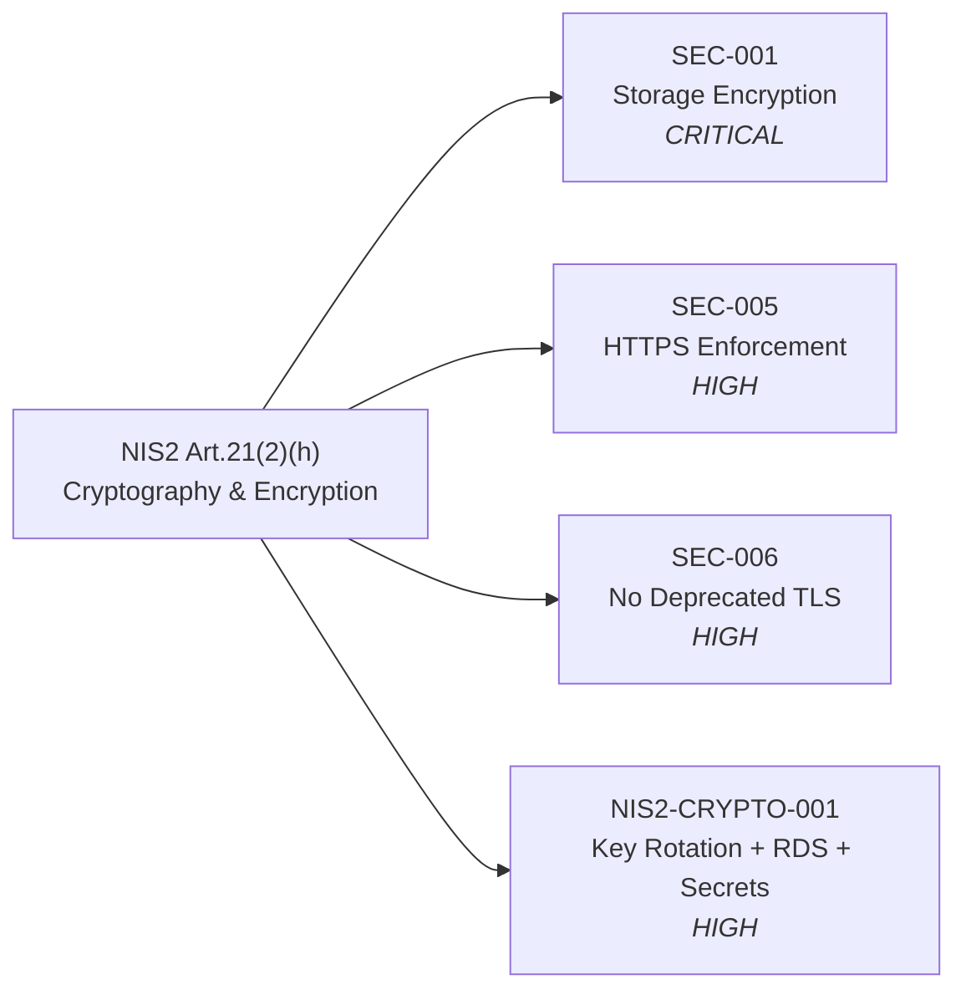

# NIS2 Compliance — Article 21 Controls Evidence

!!! info "Directive Reference"
    **EU Directive 2022/2555 (NIS2)** — Network and Information Security Directive 2.
    Applicable to essential and important entities from **17 October 2024**.
    See [ADR-0010](../adrs/0010-nis2-compliance.md) for the compliance strategy decision.

This page is the **single-page evidence summary** for NIS2 Article 21
compliance audits.  Every control is linked to a traceable, machine-verifiable
artefact in the repository so that auditors can confirm current state without
requiring manual attestation.

**Legend:**
- ✅ **Automated** — enforced by an OPA policy that blocks the CI/CD pipeline
- 📋 **Documented** — evidenced by a version-controlled document or configuration file
- ⚠️ **Partial** — coverage exists but gaps remain (see gap column)
- ❌ **Gap** — not yet implemented (roadmap item)

---

## Article 21(2) Measures — Control Matrix

| Art. | Measure | Status | OPA Policy | Documentation | Gap / Notes |
|------|---------|--------|-----------|---------------|------------|
| (a) | Risk analysis and information system security policies | 📋 Documented | — | [MoSCoW Requirements](../requirements/moscow.md), [ADR index](../adrs/0001-use-terraform-for-iac.md) | Formal risk register not yet automated |
| (b) | Incident handling | 📋 Documented | — | [Operational Runbook](../runbook/index.md) | Automated alerting via `monitoring.tf` |
| (c) | Business continuity, backup, DR | ✅ + 📋 | — | [terraform/storage.tf](#art212c--business-continuity), [monitoring.tf](#monitoring) | DR RTO/RPO targets not formally documented |
| (d) | Supply chain security | ⚠️ Partial | — | [W-001](../requirements/moscow.md#wont-have) — local provider demo | Add SBOM generation in future iteration |
| (e) | Security in acquisition, development, and maintenance | ✅ Automated | SEC-002, SEC-004 | [CI/CD Pipeline](../.github/workflows/docs-pipeline.yml), [OPA Policies](opa-policies.md) | |
| (f) | Effectiveness assessment of risk-management measures | ✅ Automated | All policies (76 tests) | [Security Controls](../security/index.md), [Doc Coverage Gate](../doc-review/index.md) | |
| (g) | Cyber hygiene and cybersecurity training | 📋 Documented | — | [Onboarding Guide](../onboarding/index.md), [Ansible hardening.yml](../configuration/ansible.md) | Formal training records outside repo scope |
| (h) | Cryptography and encryption | ✅ Automated | SEC-001, SEC-006, NIS2-CRYPTO-001 | [Security Controls](../security/index.md) | |
| (i) | HR security, access control, asset management | ✅ Automated | SEC-003, FINOPS-001 | [IAM Summary](../infrastructure/terraform.md), [FinOps](../finops/index.md) | |
| (j) | MFA and secured communications | ✅ Automated | SEC-005, SEC-006 | [Security Controls](../security/index.md) | MFA requires IdP integration outside repo scope |

---

## Detailed Evidence by Measure

### Art.21(2)(a) — Risk Analysis and Security Policies

**Requirement:** Entities must have policies on risk analysis and information
system security.

**Evidence:**

| Artefact | Type | Link | Description |
|---------|------|------|-------------|
| MoSCoW Requirements | Policy document | [requirements/moscow.md](../requirements/moscow.md) | Prioritised business and security requirements with explicit NIS2 section |
| ADR-0002 | Architecture decision | [adrs/0002](../adrs/0002-use-opa-for-policy.md) | Rationale for OPA policy enforcement |
| ADR-0010 | Architecture decision | [adrs/0010](../adrs/0010-nis2-compliance.md) | NIS2 compliance strategy decision |
| OPA policies | Automated control | [compliance/opa-policies.md](opa-policies.md) | 8 automated policy controls with documented rationale |
| Traceability matrix | Bidirectional map | [traceability/index.md](../traceability/index.md) | Requirement → ADR → Policy → Implementation chain |

**Audit checkpoint:** The traceability matrix is generated from machine-readable
`__rego__metadoc__` blocks and front-matter in ADRs — evidence cannot be
forged without a code change visible in git history.

---

### Art.21(2)(b) — Incident Handling

**Requirement:** Entities must have procedures for incident handling including
detection, reporting, and recovery.

**Evidence:**

| Artefact | Type | Link | Description |
|---------|------|------|-------------|
| Operational Runbook | Procedure | [runbook/index.md](../runbook/index.md) | Incident response flowchart, escalation matrix, recovery steps |
| CloudWatch alarms | Automated detection | [terraform/monitoring.tf](../infrastructure/terraform.md) | CPU, error-rate, latency, disk alarms with PagerDuty/Slack channels |
| Compliance check | Automated scan | [ansible/compliance_check.yml](../configuration/ansible.md) | Continuous host-level compliance verification |

**NIS2 Art.23 (Reporting):** Significant incidents must be reported to the
national authority within 24h (initial) and 72h (detailed).  The runbook
documents the notification procedure.

---

### Art.21(2)(c) — Business Continuity and Backup {#art212c--business-continuity}

**Requirement:** Entities must have business continuity management including
backup management, disaster recovery, and crisis management.

**Evidence:**

| Artefact | Type | Link | Description |
|---------|------|------|-------------|
| `terraform/storage.tf` | IaC | [infrastructure/terraform.md](../infrastructure/terraform.md) | S3 backup bucket with cross-region replication; non-current version expiration policy |
| `terraform/monitoring.tf` | IaC | [infrastructure/terraform.md](../infrastructure/terraform.md) | Alarms on CPU, error rate, latency, disk utilisation |
| Monitoring log groups | Config | [infrastructure/terraform.md](../infrastructure/terraform.md) | 90-day (prod) / 30-day (non-prod) log retention with KMS encryption |

**Gap:** Formal RTO (Recovery Time Objective) and RPO (Recovery Point Objective)
targets are not yet documented.  Add to `docs/runbook/index.md` in next iteration.

---

### Art.21(2)(d) — Supply Chain Security

**Requirement:** Security in supply chain for network and information systems
including security aspects of relationships between entities and their direct
suppliers or service providers.

**Evidence:**

| Artefact | Type | Link | Description |
|---------|------|------|-------------|
| W-001 scoping decision | Requirement | [requirements/moscow.md](../requirements/moscow.md#wont-have) | Explicit scoping: local provider demo excludes cloud provider supply chain |

**Gap (⚠️ Partial):** The example uses the `local` Terraform provider; real
deployments must additionally:

- Maintain a Software Bill of Materials (SBOM) for container images
- Evaluate cloud provider NIS2 Article 28 obligations
- Implement dependency scanning in CI/CD

Add SBOM generation (`syft`, `grype`) to the CI/CD pipeline in the next iteration.

---

### Art.21(2)(e) — Security in Systems Acquisition, Development, and Maintenance

**Requirement:** Security in acquisition, development and maintenance of
network and information systems, including vulnerability handling and disclosure.

**Evidence:**

| Artefact | Type | Link | Description |
|---------|------|------|-------------|
| SEC-002 (deny_public_access) | OPA policy | [opa-policies.md#sec-002](opa-policies.md) | Blocks publicly exposed resources before deployment |
| SEC-004 (deny_unrestricted_network) | OPA policy | [opa-policies.md#sec-004](opa-policies.md) | Blocks unrestricted network egress |
| OPA gate (CI/CD) | CI step | [.github/workflows/docs-pipeline.yml](../adrs/0001-use-terraform-for-iac.md) | `opa eval --fail-defined` blocks `terraform apply` on violation |
| Doc coverage gate | CI step | [doc-review/index.md](../doc-review/index.md) | Infrastructure changes without documentation update fail CI |
| Ansible hardening.yml | Automation | [configuration/ansible.md](../configuration/ansible.md) | CIS Level 1 OS hardening baseline applied to all managed hosts |
| DSC RegistryEntry (TLS disable) | Automation | [dsc/index.md](../dsc/index.md) | Disables TLS 1.0/1.1 via Windows Registry on all managed Windows hosts |

---

### Art.21(2)(f) — Effectiveness Assessment

**Requirement:** Policies and procedures to assess the effectiveness of
cybersecurity risk-management measures.

**Evidence:**

| Artefact | Type | Metric | Link |
|---------|------|--------|------|
| OPA unit tests | Automated | 76/76 tests pass | [opa-policies.md](opa-policies.md) |
| Doc coverage gate | Automated | Fails build when IaC changes lack docs | [doc-review/index.md](../doc-review/index.md) |
| CI/CD pipeline | Automated | Every PR evaluates all 8 OPA policy packages | [ADR-0002](../adrs/0002-use-opa-for-policy.md) |
| Compliance check playbook | Automated | COMP-001–010 per-host checks | [configuration/ansible.md](../configuration/ansible.md) |
| Gap analysis (this page) | Manual review | Updated each release | [NIS2 Gap Analysis](#gap-analysis) |

---

### Art.21(2)(g) — Cyber Hygiene and Training

**Requirement:** Basic cyber hygiene practices and cybersecurity training.

**Evidence:**

| Artefact | Type | Link | Description |
|---------|------|------|-------------|
| Onboarding guide | Documentation | [onboarding/index.md](../onboarding/index.md) | Full local pipeline walkthrough for new team members |
| `ansible/hardening.yml` | Automation | [configuration/ansible.md](../configuration/ansible.md) | CIS L1 hardening applied to all managed hosts |
| DSC `WorkspaceSetup` configuration | Automation | [dsc/index.md](../dsc/index.md) | Hardened Windows developer workspace (TLS, services, registry) |

**Gap:** Formal cybersecurity training completion records are outside the
scope of the technical repository.  Supplement with an LMS record.

---

### Art.21(2)(h) — Cryptography and Encryption

**Requirement:** Policies and procedures regarding the use of cryptography and,
where appropriate, encryption.

**Evidence:**

| Artefact | Type | Policy | NIS2 Control |
|---------|------|--------|-------------|
| SEC-001 (deny_unencrypted_storage) | OPA | CRITICAL — blocks unencrypted EBS/S3/Azure Storage | Data at rest |
| SEC-006 (deny_deprecated_tls) | OPA | HIGH — blocks TLS 1.0/1.1 on ALB/CloudFront/Azure | Deprecated crypto |
| NIS2-CRYPTO-001 (deny_nis2_crypto) | OPA | HIGH — blocks disabled KMS rotation, unencrypted RDS, plaintext secrets | Key management, DB encryption |
| SEC-005 (deny_missing_https_redirect) | OPA | HIGH — blocks HTTP without HTTPS redirect | Encryption in transit |
| DSC RegistryEntry TLS 1.0/1.1 | Config | Disables deprecated TLS at OS level | Deprecated crypto |



---

### Art.21(2)(i) — Access Control and Asset Management

**Requirement:** Human resources security, access control policies, and asset
management.

**Evidence:**

| Artefact | Type | Policy | Control |
|---------|------|--------|---------|
| SEC-003 (deny_public_iam) | OPA | HIGH — blocks wildcard IAM principals/actions | Access control |
| FINOPS-001 (deny_missing_tags) | OPA | HIGH — blocks resources without mandatory cost-allocation tags | Asset management |
| `terraform/iam.tf` | IaC | — | Least-privilege app and CI/CD OIDC roles (no long-lived keys) |
| IAM Summary | Generated doc | — | [docs/generated/iam-summary.md](../generated/terraform-readme.md) |

---

### Art.21(2)(j) — MFA and Secured Communications

**Requirement:** The use of multi-factor authentication or continuous
authentication solutions, secured voice, video and text communications and
secured emergency communication systems.

**Evidence:**

| Artefact | Type | Policy | Control |
|---------|------|--------|---------|
| SEC-005 (deny_missing_https_redirect) | OPA | HIGH — forces HTTPS on all public endpoints | Secured communications |
| SEC-006 (deny_deprecated_tls) | OPA | HIGH — requires TLS 1.2+ on all endpoints | Secured communications |
| OIDC federation in IAM CI/CD role | IaC | — | Eliminates long-lived static credentials |

**Gap:** MFA for human user access requires IdP configuration (Azure AD, Okta)
which is outside the scope of this infrastructure-as-code example.

---

## NIS2 Policy Coverage Summary

All eight OPA policies carry explicit NIS2 article references in their
`__rego__metadoc__` `compliance.nis2` field:

| Policy | ID | Severity | NIS2 Articles |
|--------|-----|---------|---------------|
| Mandatory FinOps Tags | FINOPS-001 | HIGH | Art.21(2)(i) |
| Storage Encryption | SEC-001 | CRITICAL | Art.21(2)(h) |
| No Public Resources | SEC-002 | CRITICAL | Art.21(2)(e), Art.21(2)(j) |
| Least-Privilege IAM | SEC-003 | HIGH | Art.21(2)(i) |
| No Unrestricted Egress | SEC-004 | HIGH | Art.21(2)(e) |
| HTTPS Enforcement | SEC-005 | HIGH | Art.21(2)(h), Art.21(2)(j) |
| No Deprecated TLS | SEC-006 | HIGH | Art.21(2)(h) |
| NIS2 Crypto & Key Management | NIS2-CRYPTO-001 | HIGH | Art.21(2)(h) |

---

## Gap Analysis {#gap-analysis}

The table below lists identified gaps and the recommended remediation actions.

| Gap | NIS2 Article | Severity | Recommended Action | Priority |
|-----|-------------|----------|-------------------|---------|
| No formal RTO/RPO targets documented | Art.21(2)(c) | Medium | Add RTO/RPO section to `docs/runbook/index.md` | Should Have |
| No SBOM for container images | Art.21(2)(d) | Medium | Add `syft`/`grype` to CI pipeline for SBOM generation | Could Have |
| MFA for human access not enforced in IaC | Art.21(2)(j) | High | Configure IdP (Azure AD/Okta) MFA policy; reference from ADR | Should Have |
| Formal training completion records | Art.21(2)(g) | Low | Supplement with LMS records; link from onboarding guide | Could Have |
| CIS AWS 3.1 — CloudTrail enabled | Art.21(2)(e) | High | Add `deny_cloudtrail_disabled.rego` policy | Should Have |
| AWS Config Rules audit trail | Art.21(2)(f) | Medium | Add `deny_config_recorder_disabled.rego` policy | Could Have |
| Vulnerability scanning (SAST/DAST/SCA) | Art.21(2)(e) | Medium | Integrate Trivy/Snyk into CI pipeline | Should Have |

---

## Audit Checklist

Use this checklist during a NIS2 supervisory inspection or self-assessment:

- [ ] **Art.21(2)(a):** [MoSCoW requirements](../requirements/moscow.md) reviewed and up to date
- [ ] **Art.21(2)(a):** All ADRs are current; no open ADRs older than 90 days
- [ ] **Art.21(2)(b):** [Runbook](../runbook/index.md) reviewed; escalation contacts are current
- [ ] **Art.21(2)(b):** Incident notification procedure tested (table-top exercise)
- [ ] **Art.21(2)(c):** Backup bucket replication verified (S3 cross-region test restore)
- [ ] **Art.21(2)(e):** CI/CD pipeline OPA gate is green — run `opa test policies/terraform/ -v`
- [ ] **Art.21(2)(f):** All 76 OPA unit tests pass — `opa test policies/ -v`
- [ ] **Art.21(2)(f):** Doc coverage gate passes — `scripts/check-doc-coverage.sh`
- [ ] **Art.21(2)(h):** No deprecated TLS in use — verify SEC-006 gate passed on last merge
- [ ] **Art.21(2)(h):** All KMS keys have rotation enabled — verify NIS2-CRYPTO-001 gate passed
- [ ] **Art.21(2)(h):** No plaintext SSM secrets — verify NIS2-CRYPTO-001 gate passed
- [ ] **Art.21(2)(i):** No wildcard IAM principals or actions — verify SEC-003 gate passed
- [ ] **Art.21(2)(j):** All public endpoints enforce HTTPS — verify SEC-005 gate passed
- [ ] **Gap analysis** reviewed and gap items are tracked in backlog

---

## Running a Full NIS2 Evidence Check Locally

```bash
# Run all OPA policy tests (must be 76/76 PASS)
opa test example/policies/terraform/ example/policies/kubernetes/ -v

# Evaluate all policies against a plan file
opa eval \
  --data example/policies/terraform/ \
  --input example/docs/generated/plan.json \
  --format pretty \
  'data.terraform.finops.deny |
   data.terraform.security.deny |
   data.terraform.iam.deny |
   data.terraform.network.deny |
   data.terraform.https.deny |
   data.terraform.tls.deny |
   data.terraform.nis2.deny'

# Run OS compliance checks (Ansible)
ansible-playbook -i example/ansible/inventory.yml example/ansible/compliance_check.yml
```

---

## Related Pages

- [OPA Policy Summary](opa-policies.md) — all policy details with remediation steps
- [Security Controls Matrix](../security/index.md) — CIS / NIST / SOC2 / NIS2 mapping
- [Traceability Matrix](../traceability/index.md) — Requirement → ADR → Policy chain
- [ADR-0010](../adrs/0010-nis2-compliance.md) — NIS2 compliance strategy decision
- [Operational Runbook](../runbook/index.md) — Incident handling (Art.21.2b)
