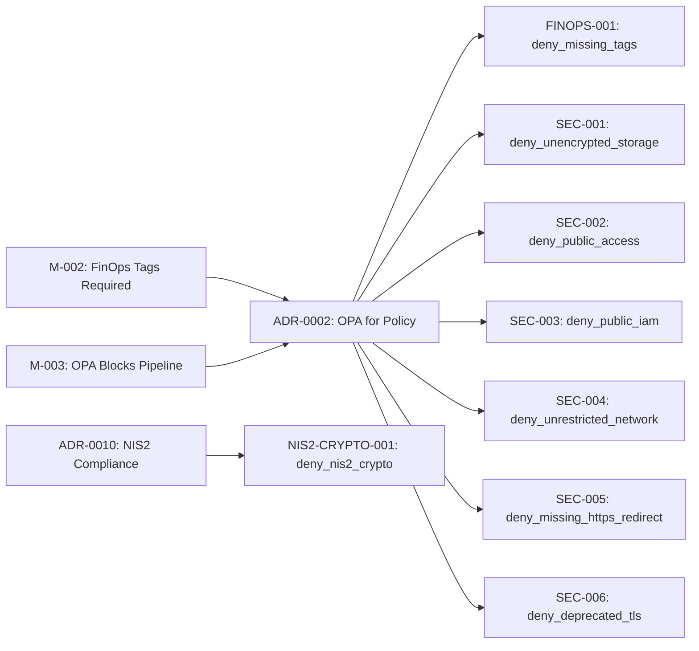
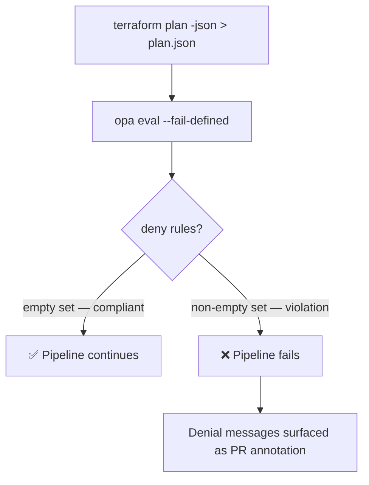

# OPA Policy Compliance Summary

!!! note "Auto-generated"
    This page is generated from the `__rego__metadoc__` blocks embedded in
    each `.rego` policy file.  Policy metadata is extracted during the CI/CD
    pipeline run and rendered here.

## Policy Inventory

### FINOPS-001 — Mandatory FinOps Cost-Allocation Tags

| Field | Value |
|-------|-------|
| **ID** | `FINOPS-001` |
| **Severity** | HIGH |
| **File** | `policies/terraform/deny_missing_tags.rego` |
| **Package** | `terraform.finops` |
| **Related ADR** | [ADR-0002 — OPA for Policy](../adrs/0002-use-opa-for-policy.md) |
| **Related Requirements** | [M-002](../requirements/moscow.md#must-have), [M-003](../requirements/moscow.md#must-have), [S-001](../requirements/moscow.md#should-have), [S-002](../requirements/moscow.md#should-have) |

**Description:**  
All Terraform resources must carry the four mandatory cost-allocation tags
(`environment`, `app_name`, `owner`, `cost_center`) so that cloud expenditure
can be attributed to the correct team and project.

**Remediation:**  
Add a `tags` block to the offending resource that includes all four required keys.

---

### SEC-001 — Storage Encryption Required

| Field | Value |
|-------|-------|
| **ID** | `SEC-001` |
| **Severity** | CRITICAL |
| **File** | `policies/terraform/deny_unencrypted_storage.rego` |
| **Package** | `terraform.security` |
| **Related ADR** | [ADR-0002 — OPA for Policy](../adrs/0002-use-opa-for-policy.md) |
| **Related Requirements** | [M-003](../requirements/moscow.md#must-have), [S-001](../requirements/moscow.md#should-have) |

**Description:**  
All storage resources must have encryption enabled to protect data at rest
and satisfy compliance frameworks such as CIS, SOC 2, and PCI-DSS.

**Remediation:**  
Set `encrypted = true` (AWS EBS / RDS) or `enable_https_traffic_only = true`
(Azure Storage) on the offending resource.

---

## Traceability

See the [Traceability Matrix](../traceability/index.md) for the full chain from
MoSCoW requirements → ADRs → OPA policies → infrastructure code.

See the [NIS2 Compliance page](nis2.md) for the Article 21 evidence map.



---

## SEC-002 — Deny Publicly Exposed Resources

| Field | Value |
|-------|-------|
| **ID** | `SEC-002` |
| **Severity** | CRITICAL |
| **File** | `policies/terraform/deny_public_access.rego` |
| **Package** | `terraform.security` |
| **Related ADR** | [ADR-0002 — OPA for Policy](../adrs/0002-use-opa-for-policy.md) |
| **Related Requirements** | [M-003](../requirements/moscow.md#must-have), [S-001](../requirements/moscow.md#should-have), [CYB-002](../requirements/moscow.md#should-have) |
| **CIS** | AWS 2.1.2, 5.2 · Azure 3.7 |
| **NIST 800-53** | AC-3, SC-7 |
| **SOC 2** | CC6.1, CC6.6 |

**Description:**  
Resources must not be publicly exposed via S3 public ACLs, open security group
ports (22, 3389, 5432, 1433, 27017), or Azure Storage public blob access.

**Remediation:**  
Set S3 ACL to `private`, restrict security group CIDR ranges to known prefixes,
and set `allow_blob_public_access = false`.

---

## SEC-003 — Deny Overly Permissive IAM

| Field | Value |
|-------|-------|
| **ID** | `SEC-003` |
| **Severity** | HIGH |
| **File** | `policies/terraform/deny_public_iam.rego` |
| **Package** | `terraform.iam` |
| **Related ADR** | [ADR-0002 — OPA for Policy](../adrs/0002-use-opa-for-policy.md) |
| **Related Requirements** | [M-003](../requirements/moscow.md#must-have), [S-001](../requirements/moscow.md#should-have), [CYB-003](../requirements/moscow.md#should-have) |
| **CIS** | AWS 1.16, 1.22 |
| **NIST 800-53** | AC-2, AC-6, IA-2 |
| **SOC 2** | CC6.3 |

**Description:**  
IAM policies must not grant wildcard principals (`*`) in trust policies or
wildcard actions (`*`, `iam:*`, `kms:*`) in permission policies.

**Remediation:**  
Replace `"Principal": "*"` with specific service/account ARNs.
Replace `"Action": "*"` with a least-privilege action list.

---

## SEC-004 — Deny Unrestricted Network Egress

| Field | Value |
|-------|-------|
| **ID** | `SEC-004` |
| **Severity** | HIGH |
| **File** | `policies/terraform/deny_unrestricted_network.rego` |
| **Package** | `terraform.network` |
| **Related ADR** | [ADR-0002 — OPA for Policy](../adrs/0002-use-opa-for-policy.md) |
| **Related Requirements** | [M-003](../requirements/moscow.md#must-have), [S-001](../requirements/moscow.md#should-have), [CYB-004](../requirements/moscow.md#should-have) |
| **CIS** | AWS 5.3, 5.4 · Azure 6.2 |
| **NIST 800-53** | SC-7, CA-3 |
| **SOC 2** | CC6.6, CC6.7 |

**Description:**  
Network security rules must not permit all outbound traffic (unrestricted
egress). Subnets must use RFC-1918 private CIDR ranges.

**Remediation:**  
Replace `allow all outbound` rules with explicit allow-lists. Change subnet
CIDRs to private ranges (10.x.x.x, 172.16-31.x.x, 192.168.x.x).

---

## Full Security Controls Matrix

See the [Security Controls](../security/index.md) page for the complete
mapping of OPA policies to CIS, NIST 800-53, SOC 2, and NIS2 controls.

See the [NIS2 Compliance](nis2.md) page for the Article 21 audit evidence summary.

---

## SEC-005 — HTTPS Enforcement

| Field | Value |
|-------|-------|
| **ID** | `SEC-005` |
| **Severity** | HIGH |
| **File** | `policies/terraform/deny_missing_https_redirect.rego` |
| **Package** | `terraform.https` |
| **Related ADR** | [ADR-0002 — OPA for Policy](../adrs/0002-use-opa-for-policy.md) |
| **Related Requirements** | [M-003](../requirements/moscow.md#must-have), [S-001](../requirements/moscow.md#should-have), [CYB-002](../requirements/moscow.md#should-have-cybersecurity) |
| **NIS2** | Art.21(2)(h) — Cryptography, Art.21(2)(j) — Secured communications |
| **CIS** | AWS 8.2 |
| **NIST 800-53** | SC-8, SC-23 |
| **SOC 2** | CC6.7 |

**Description:**  
Public HTTP (port 80) listeners must redirect to HTTPS. Plain-text HTTP is
prohibited on internet-facing load balancers and application gateways.

**Remediation:**  
Add a redirect action from HTTP (port 80) to HTTPS (port 443) on the load
balancer listener. Set `protocol = "HTTPS"` in the redirect configuration.

---

## SEC-006 — Prohibit Deprecated TLS Versions

| Field | Value |
|-------|-------|
| **ID** | `SEC-006` |
| **Severity** | HIGH |
| **File** | `policies/terraform/deny_deprecated_tls.rego` |
| **Package** | `terraform.tls` |
| **Related ADR** | [ADR-0002 — OPA for Policy](../adrs/0002-use-opa-for-policy.md) |
| **Related Requirements** | [M-003](../requirements/moscow.md#must-have), [NIS2-002](../requirements/moscow.md#should-have--nis2-compliance-eu-20222555) |
| **NIS2** | Art.21(2)(h) — Cryptography and encryption |
| **CIS** | AWS 2.9, Azure 9.3 |
| **NIST 800-53** | SC-8, SC-23, IA-7 |
| **SOC 2** | CC6.7, CC6.8 |

**Description:**  
TLS 1.0 and TLS 1.1 are cryptographically broken (BEAST, POODLE, DROWN).
Only TLS 1.2 or higher is permitted on internet-facing and internal endpoints.

**Remediation:**  
Update the SSL/TLS policy to `ELBSecurityPolicy-TLS13-1-2-2021-06` or newer
on AWS ALB.  Set `minimum_protocol_version = TLSv1.2_2021` on CloudFront.

---

## NIS2-CRYPTO-001 — NIS2 Cryptography and Key Management

| Field | Value |
|-------|-------|
| **ID** | `NIS2-CRYPTO-001` |
| **Severity** | HIGH |
| **File** | `policies/terraform/deny_nis2_crypto.rego` |
| **Package** | `terraform.nis2` |
| **Related ADR** | [ADR-0010 — NIS2 Compliance](../adrs/0010-nis2-compliance.md) |
| **Related Requirements** | [NIS2-002](../requirements/moscow.md#should-have--nis2-compliance-eu-20222555), [M-003](../requirements/moscow.md#must-have) |
| **NIS2** | Art.21(2)(h) — Cryptography and encryption |
| **NIST 800-53** | SC-12, SC-28, SC-13 |
| **SOC 2** | CC6.1, CC6.7 |
| **GDPR** | Art.32 |

**Description:**  
Enforces three key-management and encryption obligations mandated by NIS2
Article 21(2)(h):

1. AWS KMS keys must have **automatic key rotation** enabled.
2. AWS RDS database instances must have **storage encryption** enabled.
3. AWS SSM Parameter Store entries with **secret-like names** (`password`,
   `secret`, `token`, `credential`, `apikey`, `private_key`) must use
   `SecureString` type — not plaintext `String`.

**Remediation:**

```hcl
# 1) Enable KMS key rotation
resource "aws_kms_key" "app" {
  enable_key_rotation = true
}

# 2) Enable RDS encryption
resource "aws_db_instance" "main" {
  storage_encrypted = true
  kms_key_id        = aws_kms_key.app.arn
}

# 3) Use SecureString for secrets
resource "aws_ssm_parameter" "db_password" {
  type  = "SecureString"
  value = var.db_password
}
```

---

## CI/CD Gate Behaviour



## Running Policies Locally

```bash
# Evaluate all policies against a plan file
opa eval \
  --data policies/terraform/ \
  --input plan.json \
  --format pretty \
  'data.terraform.finops.deny |
   data.terraform.security.deny |
   data.terraform.iam.deny |
   data.terraform.network.deny |
   data.terraform.https.deny |
   data.terraform.tls.deny |
   data.terraform.nis2.deny'

# Run all unit tests (76 tests)
opa test policies/ -v
```
