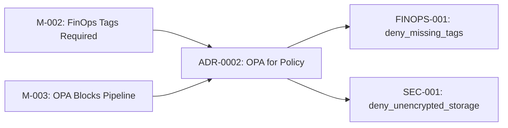
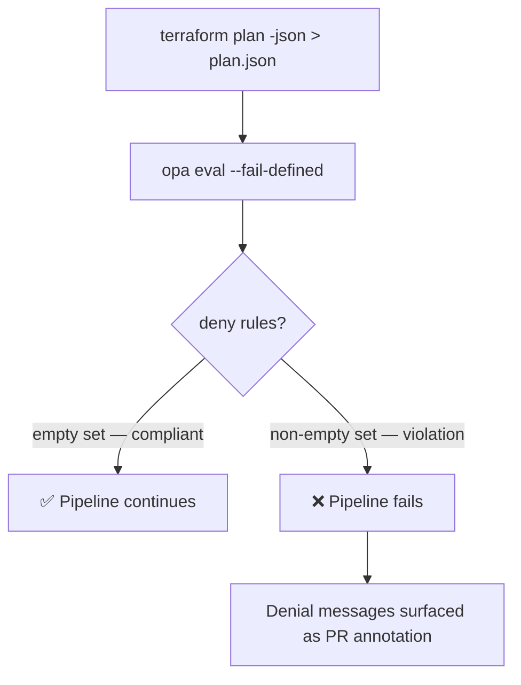

# OPA Policy Compliance Summary

!!! note "Auto-generated"
    This page is generated from the `__rego__metadoc__` blocks embedded in
    each `.rego` policy file.  Policy metadata is extracted during the CI/CD
    pipeline run and rendered here.

## Policy Inventory

### FINOPS-001 — Mandatory FinOps Cost-Allocation Tags

| Field | Value |
|-------|-------|
| **ID** | `FINOPS-001` |
| **Severity** | HIGH |
| **File** | `policies/terraform/deny_missing_tags.rego` |
| **Package** | `terraform.finops` |
| **Related ADR** | [ADR-0002 — OPA for Policy](../adrs/0002-use-opa-for-policy.md) |
| **Related Requirements** | [M-002](../requirements/moscow.md#must-have), [M-003](../requirements/moscow.md#must-have), [S-001](../requirements/moscow.md#should-have), [S-002](../requirements/moscow.md#should-have) |

**Description:**  
All Terraform resources must carry the four mandatory cost-allocation tags
(`environment`, `app_name`, `owner`, `cost_center`) so that cloud expenditure
can be attributed to the correct team and project.

**Remediation:**  
Add a `tags` block to the offending resource that includes all four required keys.

---

### SEC-001 — Storage Encryption Required

| Field | Value |
|-------|-------|
| **ID** | `SEC-001` |
| **Severity** | CRITICAL |
| **File** | `policies/terraform/deny_unencrypted_storage.rego` |
| **Package** | `terraform.security` |
| **Related ADR** | [ADR-0002 — OPA for Policy](../adrs/0002-use-opa-for-policy.md) |
| **Related Requirements** | [M-003](../requirements/moscow.md#must-have), [S-001](../requirements/moscow.md#should-have) |

**Description:**  
All storage resources must have encryption enabled to protect data at rest
and satisfy compliance frameworks such as CIS, SOC 2, and PCI-DSS.

**Remediation:**  
Set `encrypted = true` (AWS EBS / RDS) or `enable_https_traffic_only = true`
(Azure Storage) on the offending resource.

---

## Traceability

See the [Traceability Matrix](../traceability/index.md) for the full chain from
MoSCoW requirements → ADRs → OPA policies → infrastructure code.



---

## CI/CD Gate Behaviour



## Running Policies Locally

```bash
# Evaluate all policies against a plan file
opa eval \
  --data policies/terraform/ \
  --input plan.json \
  --format pretty \
  'data.terraform.finops.deny | data.terraform.security.deny'

# Run unit tests
opa test policies/terraform/ -v
```
