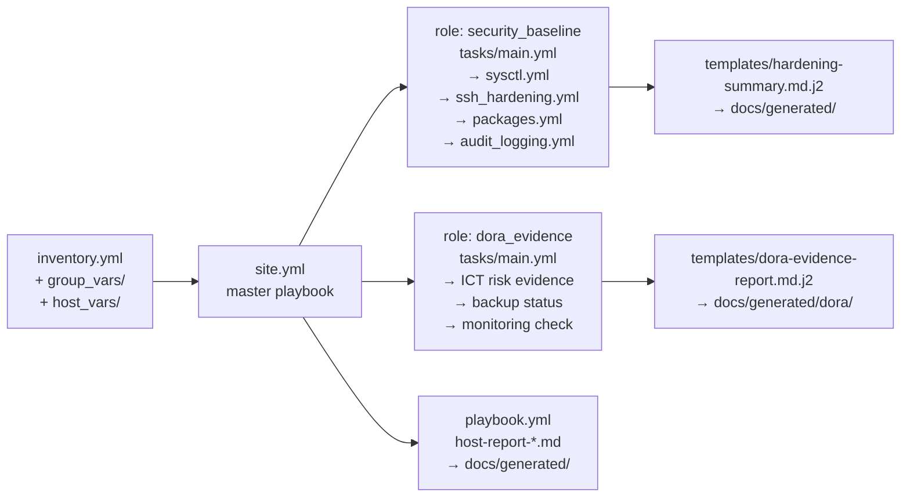

# Ansible Configuration — Host Report

!!! note "Auto-generated"
    The host report below is generated by the **Ansible playbook** at
    `ansible/playbook.yml` using the `setup` module and a Jinja2 template.
    It reflects the **live state** of the target host at pipeline execution time.

## Architecture



## Repository Structure

```
example/ansible/
├── site.yml                        # Master orchestration playbook
├── playbook.yml                    # Host report playbook
├── hardening.yml                   # Standalone hardening playbook
├── compliance_check.yml            # Standalone compliance check
├── inventory.yml                   # Static inventory with host groups
├── group_vars/
│   ├── all.yml                     # Shared variables (sysctl, SSH, DORA)
│   ├── webservers.yml              # Web-tier overrides (TLS, log paths)
│   └── databases.yml               # DB-tier overrides (port, pg settings)
├── host_vars/
│   └── localhost.yml               # CI/CD demo overrides
├── roles/
│   ├── security_baseline/          # CIS Benchmark Level 1 OS hardening
│   │   ├── tasks/
│   │   │   ├── main.yml            # Entry-point, includes sub-tasks
│   │   │   ├── sysctl.yml          # Kernel hardening (net, memory protection)
│   │   │   ├── ssh_hardening.yml   # SSH daemon config (CIS 5.2)
│   │   │   ├── packages.yml        # Remove insecure packages (telnet, rsh)
│   │   │   └── audit_logging.yml   # auditd / journald check (DORA Art.10)
│   │   ├── handlers/main.yml       # restart sshd, reload sysctl
│   │   ├── defaults/main.yml       # Default variable values
│   │   ├── meta/main.yml           # Role metadata + dependencies
│   │   └── templates/
│   │       └── hardening-summary.md.j2  # Hardening report template
│   └── dora_evidence/              # DORA audit evidence collection
│       ├── tasks/main.yml          # Art.9/10/12/17 evidence collection
│       ├── defaults/main.yml       # Default evidence output paths
│       ├── meta/main.yml           # Role metadata (depends: security_baseline)
│       └── templates/
│           └── dora-evidence-report.md.j2  # DORA evidence report template
└── templates/
    ├── host-report.md.j2           # General host report
    ├── hardening-report.md.j2      # Hardening check report
    └── compliance-report.md.j2     # Compliance summary
```

## Roles

### `security_baseline`

Applies CIS Benchmark Level 1 hardening across all managed hosts. Each
sub-task file corresponds to one CIS section:

| Task file | CIS Section | Controls |
|-----------|-------------|---------|
| `sysctl.yml` | 3.x | TCP SYN cookies, ASLR, log_martians, redirect prevention |
| `ssh_hardening.yml` | 5.2 | No root login, no empty passwords, MaxAuthTries, timeouts |
| `packages.yml` | 2.x | Remove telnet, rsh-client; install audit tools |
| `audit_logging.yml` | 4.x | auditd active, journald persistent (DORA Art.10) |

Generates `docs/generated/hardening-report-<host>.md` from
`templates/hardening-summary.md.j2`.

### `dora_evidence`

Collects and reports on DORA (EU 2022/2554) audit evidence:

| Task | DORA Article | Evidence |
|------|-------------|---------|
| Kernel version + pending patches | Art.9 | Patch currency |
| auditd / journald status | Art.10 | Log integrity |
| Log retention policy check | Art.10/15 | Lifecycle governance |
| Backup agent status | Art.12 | Recovery capability |
| Monitoring agent status | Art.17 | Incident detection |
| Open ports (network exposure) | Art.9 | Network risk |

Generates `docs/generated/dora/dora-evidence-<host>.md` from
`templates/dora-evidence-report.md.j2`.

## group_vars Hierarchy

```
all.yml               ← applies to every host
├── webservers.yml    ← overrides/additions for webservers group
└── databases.yml     ← overrides/additions for databases group
    └── host_vars/localhost.yml  ← highest-priority; CI demo overrides
```

Key variables in `all.yml`:

| Variable | Default | Purpose |
|----------|---------|---------|
| `cis_password_max_days` | 90 | Password max age |
| `cis_ssh_permit_root_login` | `"no"` | CIS 5.2.2 |
| `cis_ssh_max_auth_tries` | 4 | CIS 5.2.5 |
| `dora_retention_days` | 90 | Log retention (DORA Art.10/15) |
| `sysctl_settings` | (dict) | Kernel hardening map |

## How It Works

1. The `setup` module gathers `ansible_facts` from every host in the inventory.
2. The `template` task renders `ansible/templates/host-report.md.j2` with the
   collected facts.
3. The resulting Markdown file is written to `docs/generated/` and included
   in this MkDocs site.

```{.include}
generated/host-report-localhost.md
```

!!! tip "Extending to real hosts"
    Replace `localhost` in `ansible/inventory.yml` with real hostnames or use a
    dynamic inventory plugin (e.g., `amazon.aws.aws_ec2`) to gather facts from
    production servers.
