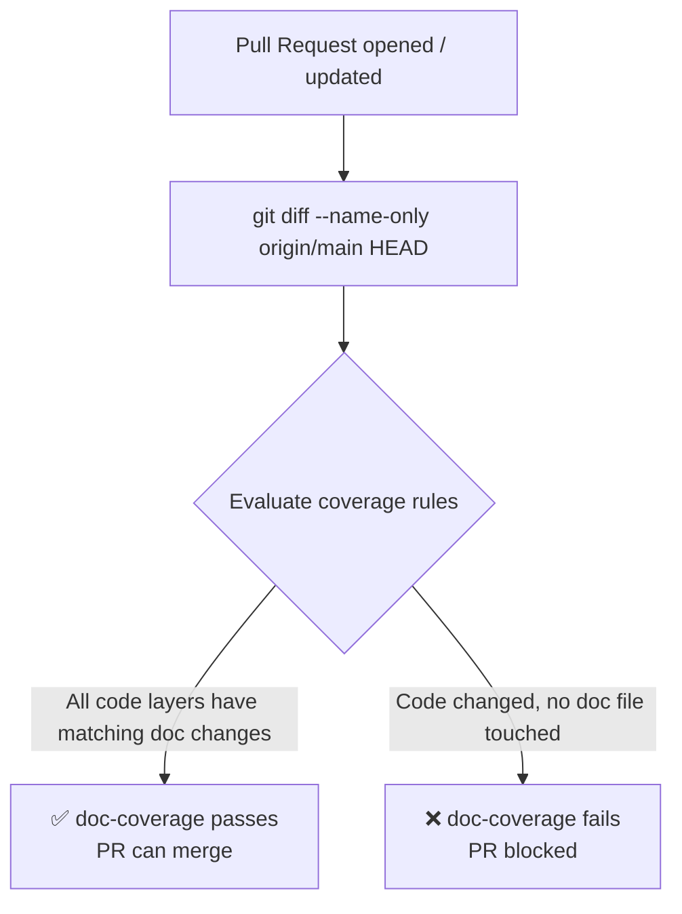

# Documentation Coverage Gate

The **documentation coverage gate** is a CI job (`doc-coverage`) that runs on
every pull request and fails the build when infrastructure or policy code is
changed without a corresponding documentation update.

This showcases one of the core benefits of **documentation as code**: the
currency of the docs can be *enforced automatically*, not left to PR checklists
or reviewer memory.

---

## How It Works



The script `scripts/check-doc-coverage.sh` compares the set of files changed in
the PR against six rules:

| Rule | Trigger | Required doc path |
|------|---------|------------------|
| **DOC-TF** | `terraform/*.tf` changed | `docs/infrastructure/` or `docs/network/` |
| **DOC-OPA** | `policies/terraform/*.rego` changed | `docs/compliance/` or `docs/security/` |
| **DOC-DSC** | `dsc/resources/` changed | `docs/dsc/` |
| **DOC-ANS** | `ansible/` changed | `docs/configuration/` |
| **DOC-K8S** | `kubernetes/` changed | `docs/kubernetes/` |
| **DOC-HELM** | `helm/` changed | `docs/kubernetes/` |

---

## Example Gate Output

```text
── Changed files ────────────────────────────────────────────────────────
  example/terraform/network.tf
  example/docs/network/index.md
  example/policies/terraform/deny_public_access.rego
─────────────────────────────────────────────────────────────────────────
✅ DOC-TF:  Terraform changes accompanied by docs/network/index.md ✓
❌ DOC-OPA: OPA policy changes must be accompanied by docs/compliance/ or docs/security/ updates
   Code changes matched: example/policies/terraform/[^_].*\.rego$
   Expected doc changes matching: example/docs/(compliance|security)/
⏭️  DOC-DSC: DSC resource changes — no code changes (skipped)
⏭️  DOC-ANS: Ansible changes — no code changes (skipped)
⏭️  DOC-K8S: Kubernetes manifest changes — no code changes (skipped)
⏭️  DOC-HELM: Helm chart changes — no code changes (skipped)
─────────────────────────────────────────────────────────────────────────
❌ Documentation coverage gate FAILED — 1 rule(s) violated.
   Update the relevant docs/ page(s) alongside your code changes.
```

---

## Traceability

| Artefact | Link |
|----------|------|
| Script | `scripts/check-doc-coverage.sh` |
| CI job | `.github/workflows/docs-pipeline.yml` → `doc-coverage` job |
| ADR | [ADR-0006](../adrs/0006-enforce-doc-coverage-gate.md) |
| Requirements | [D-001, D-002](../requirements/moscow.md#should-have--documentation-governance) |

---

## Running Locally

```bash
# From the repo root — check current branch against main
BASE_BRANCH=main bash example/scripts/check-doc-coverage.sh

# Check two specific commits
BASE_REF=abc123 HEAD_REF=def456 bash example/scripts/check-doc-coverage.sh
```

!!! tip "Adding a New Rule"
    Open `scripts/check-doc-coverage.sh` and append a `check_rule` call:
    ```bash
    check_rule "DOC-MYMODULE" \
      "example/mymodule/" \
      "example/docs/mymodule/" \
      "MyModule changes must be accompanied by docs/mymodule/ updates"
    ```
    Commit both the script change and a matching entry in
    `docs/requirements/moscow.md` to keep the traceability chain intact.
