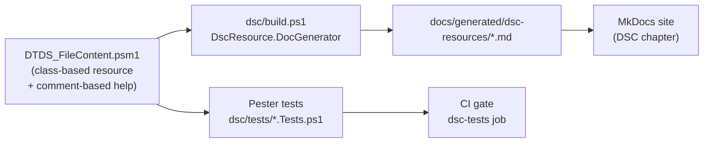
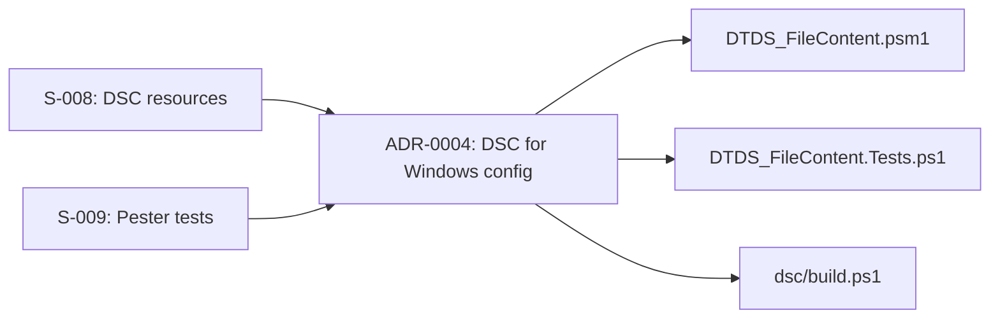

# PowerShell Desired State Configuration

PowerShell **Desired State Configuration (DSC)** is a declarative platform
for expressing and enforcing the desired state of Windows (and Linux) systems.
It fits directly into the deterministic documentation pipeline: the same
class that defines the configuration also carries the comment-based help from
which `DscResource.DocGenerator` auto-generates Markdown.

!!! info "Architectural decision"
    See [ADR-0004](../adrs/0004-use-dsc-for-windows-config.md) for the
    rationale behind choosing DSC + DscResource.DocGenerator.

---

## How It Fits the Deterministic Pipeline



The comment-based help inside the `.psm1` class is the **single source of
truth** — documentation cannot drift from the implementation because it is
generated from the same file.

---

## Repository Structure

```
example/dsc/
├── DscConfiguration.ps1          # Example DSC configuration (MOF compilation)
├── build.ps1                     # Runs DscResource.DocGenerator → docs/generated/
├── resources/
│   └── DTDS_FileContent/
│       ├── DTDS_FileContent.psm1 # Class-based DSC resource + comment-based help
│       └── DTDS_FileContent.psd1 # Module manifest
└── tests/
    └── DTDS_FileContent.Tests.ps1 # Pester 5 unit tests
```

---

## DTDS_FileContent Resource

The `DTDS_FileContent` resource ensures that a UTF-8 text file at a given
path either exists with the required content, or is absent.

| Property | Type | Key | Required | Description |
|----------|------|-----|---------|-------------|
| `Path` | `string` | ✅ | ✅ | Full path to the managed file |
| `Content` | `string` | | ✅ | Exact text content the file must contain |
| `Ensure` | `Ensure` | | | `Present` (default) or `Absent` |

### Example Usage

```powershell
DTDS_FileContent PlatformReadme {
    Path    = 'C:\PlatformWorkspace\README.md'
    Content = '# Platform Workspace — managed by DSC'
    Ensure  = 'Present'
}
```

---

## Running the Documentation Generator

```powershell
# Install prerequisites (once)
Install-Module -Name DscResource.DocGenerator, PlatyPS -Force

# Generate documentation into docs/generated/dsc-resources/
pwsh -File example/dsc/build.ps1
```

The generated Markdown pages appear in the **Generated** section of the
MkDocs navigation.

---

## Running Pester Unit Tests

```powershell
# Install prerequisites (once)
Install-Module -Name Pester -Force -SkipPublisherCheck

# Run all DSC resource tests
Invoke-Pester -Path example/dsc/tests/ -Output Detailed
```

The CI/CD pipeline runs these tests in the `dsc-tests` job before the
documentation build — see `.github/workflows/docs-pipeline.yml`.

---

## Pester Test Coverage

| Test Case | Description |
|-----------|-------------|
| `Test()` — absent, Ensure = Present | Returns `$false` when file is missing |
| `Test()` — present, Ensure = Absent | Returns `$false` when file exists but must be removed |
| `Set()` creates file | File is written with correct content |
| `Test()` after `Set()` | Returns `$true` when in desired state |
| `Get()` — Present state | Reads current content from disk |
| Content mismatch | `Test()` returns `$false` when content differs |
| `Set()` removes file | File is removed when `Ensure = Absent` |
| `Get()` — Absent state | Reflects removal correctly |
| Parent directory creation | `Set()` creates intermediate directories |
| Idempotency | Two sequential `Set()` calls leave `Test()` returning `$true` |

---

## Traceability

See the [Traceability Matrix](../traceability/index.md) for the full chain:



---

## Windows vs. Linux

Class-based DSC resources written for PowerShell Core 7.2+ work
**cross-platform**:

| Activity | Linux CI | Windows Node |
|----------|---------|--------------|
| Pester unit tests | ✅ | ✅ |
| DscResource.DocGenerator | ✅ | ✅ |
| MOF compilation (`DscConfiguration.ps1`) | ✅ | ✅ |
| LCM apply (`Start-DscConfiguration`) | ❌ (LCM requires Windows) | ✅ |

This means the full CI pipeline — including documentation generation and
unit testing — runs on the existing Ubuntu runners without needing a
Windows runner.
