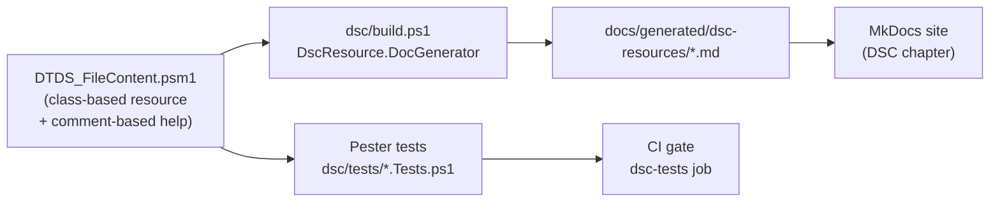
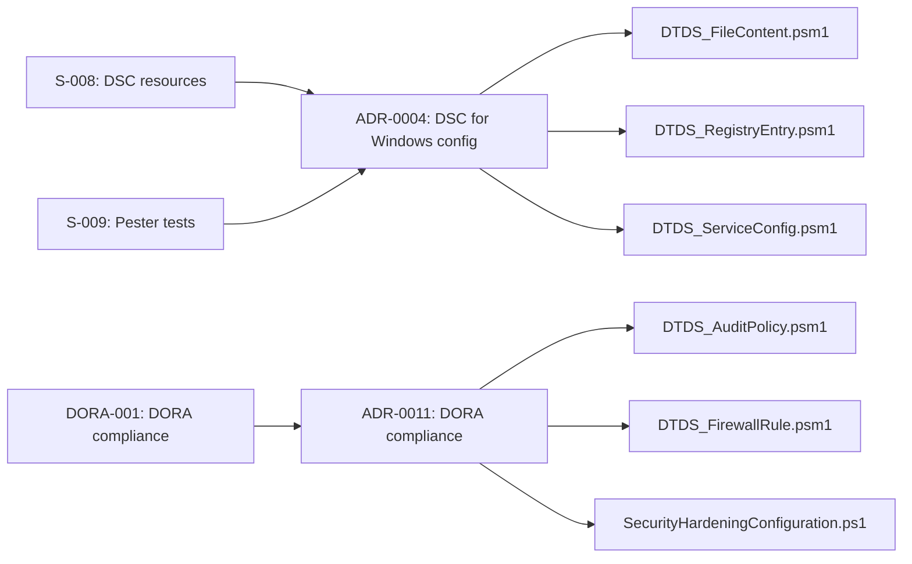

# PowerShell Desired State Configuration

PowerShell **Desired State Configuration (DSC)** is a declarative platform
for expressing and enforcing the desired state of Windows (and Linux) systems.
It fits directly into the deterministic documentation pipeline: the same
class that defines the configuration also carries the comment-based help from
which `DscResource.DocGenerator` auto-generates Markdown.

!!! info "Architectural decision"
    See [ADR-0004](../adrs/0004-use-dsc-for-windows-config.md) for the
    rationale behind choosing DSC + DscResource.DocGenerator.

---

## How It Fits the Deterministic Pipeline



The comment-based help inside the `.psm1` class is the **single source of
truth** — documentation cannot drift from the implementation because it is
generated from the same file.

---

## Repository Structure

```
example/dsc/
├── DscConfiguration.ps1              # Main example configuration (all resources)
├── SecurityHardeningConfiguration.ps1 # DORA/NIS2 security hardening config
├── build.ps1                         # DscResource.DocGenerator → docs/generated/
├── resources/
│   ├── DTDS_FileContent/             # File content management (cross-platform)
│   │   ├── DTDS_FileContent.psm1
│   │   └── DTDS_FileContent.psd1
│   ├── DTDS_RegistryEntry/           # Windows registry value management
│   │   ├── DTDS_RegistryEntry.psm1
│   │   └── DTDS_RegistryEntry.psd1
│   ├── DTDS_ServiceConfig/           # Windows service state management
│   │   ├── DTDS_ServiceConfig.psm1
│   │   └── DTDS_ServiceConfig.psd1
│   ├── DTDS_AuditPolicy/             # Windows audit policy (DORA Art.10)
│   │   ├── DTDS_AuditPolicy.psm1
│   │   └── DTDS_AuditPolicy.psd1
│   └── DTDS_FirewallRule/            # Windows Firewall rules (SEC-004, CYB-004)
│       ├── DTDS_FirewallRule.psm1
│       └── DTDS_FirewallRule.psd1
└── tests/
    ├── DTDS_FileContent.Tests.ps1    # 11 Pester tests
    ├── DTDS_RegistryEntry.Tests.ps1  # Pester tests
    ├── DTDS_ServiceConfig.Tests.ps1  # Pester tests
    ├── DTDS_AuditPolicy.Tests.ps1    # 12 Pester tests (DORA/NIS2)
    └── DTDS_FirewallRule.Tests.ps1   # 11 Pester tests (SEC-004, CYB-004)
```

---

## DTDS_FileContent Resource

The `DTDS_FileContent` resource ensures that a UTF-8 text file at a given
path either exists with the required content, or is absent.

| Property | Type | Key | Required | Description |
|----------|------|-----|---------|-------------|
| `Path` | `string` | ✅ | ✅ | Full path to the managed file |
| `Content` | `string` | | ✅ | Exact text content the file must contain |
| `Ensure` | `Ensure` | | | `Present` (default) or `Absent` |

### Example Usage

```powershell
DTDS_FileContent PlatformReadme {
    Path    = 'C:\PlatformWorkspace\README.md'
    Content = '# Platform Workspace — managed by DSC'
    Ensure  = 'Present'
}
```

---

## DTDS_AuditPolicy Resource

The `DTDS_AuditPolicy` resource configures a **Windows Security Audit Policy** subcategory
via `auditpol.exe`. Required for DORA Art.10 (log integrity) and CIS Benchmark Section 17.
On Linux/macOS the resource is a no-op (audit policy managed via `auditd`).

| Property | Type | Key | Required | Description |
|----------|------|-----|---------|-------------|
| `Subcategory` | `string` | ✅ | ✅ | Audit policy subcategory name (as per `auditpol /list`) |
| `AuditFlag` | `AuditTracking` | | ✅ | `NoAuditing`, `Success`, `Failure`, or `SuccessAndFailure` |

### Example Usage

```powershell
# DORA Art.10 — log all logon events (success and failure)
DTDS_AuditPolicy AuditLogon {
    Subcategory = 'Logon'
    AuditFlag   = [AuditTracking]::SuccessAndFailure
}

# CIS 17.2.1 — log process creation for malware detection
DTDS_AuditPolicy AuditProcessCreation {
    Subcategory = 'Process Creation'
    AuditFlag   = [AuditTracking]::Success
}
```

### Compliance Mapping

| Subcategory | AuditFlag | CIS Control | DORA Article |
|-------------|-----------|-------------|-------------|
| Logon | SuccessAndFailure | 17.5.1 | Art.10 |
| Account Lockout | Failure | 17.5.2 | Art.10 |
| Process Creation | Success | 17.2.1 | Art.10 |
| Sensitive Privilege Use | Failure | 17.8.1 | Art.9 |
| Audit Policy Change | SuccessAndFailure | 17.7.1 | Art.10 |

---

## DTDS_FirewallRule Resource

The `DTDS_FirewallRule` resource creates, updates, or removes **Windows Defender Firewall** rules
via `netsh advfirewall`. Implements CIS Benchmark Section 9, SEC-004, and CYB-004.
On Linux/macOS the resource is a no-op (firewall managed via Ansible `security_baseline` role).

| Property | Type | Key | Required | Description |
|----------|------|-----|---------|-------------|
| `RuleName` | `string` | ✅ | ✅ | Unique display name of the rule |
| `Direction` | `FirewallDirection` | | ✅ | `Inbound` or `Outbound` |
| `Protocol` | `string` | | ✅ | `TCP`, `UDP`, or `Any` |
| `LocalPort` | `string` | | ✅ | Port, range, or `Any` |
| `Action` | `FirewallAction` | | ✅ | `Allow` or `Block` |
| `Ensure` | `FirewallEnsure` | | | `Present` (default) or `Absent` |
| `Description` | `string` | | | Audit-trail description |

### Example Usage

```powershell
# Block RDP from internet — CYB-004, DORA Art.9
DTDS_FirewallRule BlockRdpInbound {
    RuleName    = 'DTDS-Block-RDP-External'
    Direction   = [FirewallDirection]::Inbound
    Protocol    = 'TCP'
    LocalPort   = '3389'
    Action      = [FirewallAction]::Block
    Ensure      = [FirewallEnsure]::Present
    Description = 'Block RDP from internet — CYB-004'
}

# Allow HTTPS outbound for package managers
DTDS_FirewallRule AllowHttpsOutbound {
    RuleName  = 'DTDS-Allow-HTTPS-Outbound'
    Direction = [FirewallDirection]::Outbound
    Protocol  = 'TCP'
    LocalPort = '443'
    Action    = [FirewallAction]::Allow
}
```

---

## SecurityHardeningConfiguration.ps1

The `SecurityHardeningConfiguration.ps1` file is a dedicated DORA/NIS2 security hardening
configuration that combines all three security-relevant resources:

```
SecurityHardening MOF
├── 6 × DTDS_AuditPolicy  — CIS Section 17, DORA Art.10
│   ├── Logon             = SuccessAndFailure
│   ├── Account Lockout   = Failure
│   ├── Process Creation  = Success
│   ├── Privilege Use     = Failure
│   ├── Policy Change     = SuccessAndFailure
│   └── System Integrity  = SuccessAndFailure
├── 6 × DTDS_FirewallRule — CIS Section 9, DORA Art.9
│   ├── Block RDP inbound (external)
│   ├── Block Telnet inbound
│   ├── Block FTP inbound
│   ├── Allow HTTPS inbound
│   ├── Allow HTTPS outbound
│   └── Block SMB external
└── 2 × DTDS_FileContent  — Compliance markers
    ├── security-hardening-applied.txt
    └── audit-policy-README.txt
```

---

## Running the Documentation Generator

```powershell
# Install prerequisites (once)
Install-Module -Name DscResource.DocGenerator, PlatyPS -Force

# Generate documentation into docs/generated/dsc-resources/
pwsh -File example/dsc/build.ps1
```

The generated Markdown pages appear in the **Generated** section of the
MkDocs navigation.

---

## Running Pester Unit Tests

```powershell
# Install prerequisites (once)
Install-Module -Name Pester -Force -SkipPublisherCheck

# Run all DSC resource tests
Invoke-Pester -Path example/dsc/tests/ -Output Detailed
```

The CI/CD pipeline runs these tests in the `dsc-tests` job before the
documentation build — see `.github/workflows/docs-pipeline.yml`.

---

## Pester Test Coverage

| Resource | Test Cases | Coverage |
|----------|-----------|---------|
| `DTDS_FileContent` | 11 | Full lifecycle, idempotency, Absent |
| `DTDS_RegistryEntry` | Pester tests | Present/Absent, Windows no-op on Linux |
| `DTDS_ServiceConfig` | Pester tests | Running/Stopped, startup types |
| `DTDS_AuditPolicy` | 12 | AuditTracking enum, non-Windows stub, idempotency |
| `DTDS_FirewallRule` | 11 | Direction/Action, Present/Absent, Description |

---

## Traceability

See the [Traceability Matrix](../traceability/index.md) for the full chain:



---

## Windows vs. Linux

Class-based DSC resources written for PowerShell Core 7.2+ work
**cross-platform**:

| Activity | Linux CI | Windows Node |
|----------|---------|--------------|
| Pester unit tests | ✅ | ✅ |
| DscResource.DocGenerator | ✅ | ✅ |
| MOF compilation (`DscConfiguration.ps1`) | ✅ | ✅ |
| `DTDS_AuditPolicy` (auditpol) | ✅ no-op | ✅ applied |
| `DTDS_FirewallRule` (netsh) | ✅ no-op | ✅ applied |
| LCM apply (`Start-DscConfiguration`) | ❌ (LCM requires Windows) | ✅ |

This means the full CI pipeline — including documentation generation and
unit testing — runs on the existing Ubuntu runners without needing a
Windows runner.
