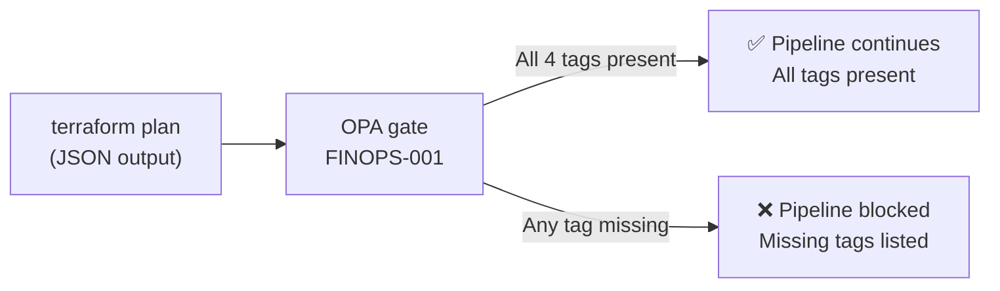
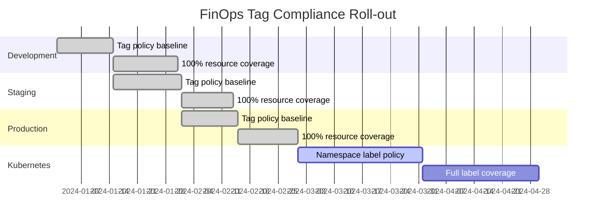

# FinOps Cost-Allocation Guide

This page is the **FinOps persona view** of the deterministic documentation
platform.  It covers cost-allocation tag policy, the FinOps OPA enforcement
gate, and a per-resource cost-centre mapping.

!!! info "FinOps Principle"
    Every cloud resource carries four mandatory tags enforced by OPA policy
    **FINOPS-001**.  Tags are the single source of truth for cost attribution
    — they are defined in code, validated in CI, and never added manually in
    the console.

---

## Mandatory Cost-Allocation Tags

| Tag Key | Example Value | Purpose |
|---------|--------------|---------|
| `environment` | `production`, `staging`, `dev` | Split costs by lifecycle stage |
| `app_name` | `dtds-example` | Attribute cost to an application |
| `owner` | `platform-team` | Route cost anomaly alerts |
| `cost_center` | `CC-1001` | Map to finance department ledger |

These tags are defined in `terraform/variables.tf` and applied to every
resource via the `common_tags` local:

```hcl
locals {
  common_tags = {
    environment = var.environment
    app_name    = var.app_name
    owner       = var.owner
    cost_center = var.cost_center
  }
}
```

---

## OPA Policy: FINOPS-001

The `deny_missing_tags.rego` policy blocks any Terraform plan that creates or
updates a resource **without all four tags**.



Policy traceability:

| Field | Value |
|-------|-------|
| Policy ID | FINOPS-001 |
| Severity | HIGH |
| MoSCoW | [M-002](../requirements/moscow.md#must-have), [M-003](../requirements/moscow.md#must-have) |
| ADR | [ADR-0002](../adrs/0002-use-opa-for-policy.md) |
| Source | `policies/terraform/deny_missing_tags.rego` |

---

## Resource Cost-Centre Mapping

All resources deployed by the example Terraform configuration are assigned
to cost centre **CC-1001** (Platform Engineering).

| Resource Type | Resource Name | Cost Centre | Owner |
|--------------|--------------|-------------|-------|
| VPC | `dtds-vpc` | CC-1001 | platform-team |
| Subnet (public × 2) | `dtds-public-*` | CC-1001 | platform-team |
| Subnet (private × 2) | `dtds-private-*` | CC-1001 | platform-team |
| Security Group | `dtds-app-sg` | CC-1001 | platform-team |
| S3 Bucket (docs) | `dtds-example-docs` | CC-1001 | platform-team |
| IAM Role | `dtds-app-role` | CC-1001 | platform-team |
| Kubernetes workload | `dtds-app` | CC-1001 | platform-team |

---

## Tag Compliance Dashboard (Mermaid Gantt as Cost Burn-Down)

The diagram below illustrates how tag-enforcement phases roll out across
environments in a typical quarter.  Each bar represents the period in which
that environment's resources were brought into full tag compliance.



---

## Cost Anomaly Runbook

### Detecting a Tag Violation in CI

When `FINOPS-001` blocks a PR, the CI log shows:

```
FinOps violations: 1
[
  "Resource aws_s3_bucket.example is missing tag: cost_center"
]
Error: Process completed with exit code 1.
```

**Resolution steps:**

1. Open `terraform/main.tf` and locate the offending resource.
2. Add `tags = local.common_tags` (or the missing tag key).
3. Run `terraform plan` locally to verify no violations.
4. Push the fix — CI `FINOPS-001` gate will re-run.

### Detecting a Tag Violation in Production

```bash
# AWS — list resources missing the cost_center tag
aws resourcegroupstaggingapi get-resources \
  --tag-filters Key=cost_center \
  --query 'ResourceTagMappingList[?Tags[?Key==`cost_center`]==`[]`]' \
  --output table
```

---

## Traceability

| Artefact | Description |
|----------|-------------|
| `policies/terraform/deny_missing_tags.rego` | OPA enforcement policy |
| `policies/terraform/deny_missing_tags_test.rego` | Unit tests (100 % coverage) |
| `terraform/variables.tf` | Tag variable definitions |
| `terraform/main.tf` | `common_tags` local applied to all resources |
| ADR | [ADR-0002](../adrs/0002-use-opa-for-policy.md) |
| Requirements | [M-002, M-003](../requirements/moscow.md#must-have), [FIN-001–FIN-003](../requirements/moscow.md#should-have--finops) |
