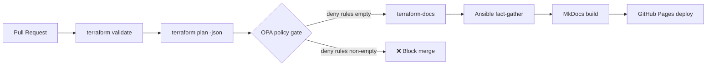

# Deterministic Technical Design Specification — Example

!!! info "What is this?"
    This repository is a **working demonstration** of the principles described in
    *"Documenting Deterministic Infrastructure Code"*.  Every page in this site
    is either **auto-generated** from source code or **version-controlled
    Markdown** — nothing is written manually after the fact.

---

## Core Principles

| Principle | Implementation |
|-----------|---------------|
| **Infrastructure as Code** | Terraform (`local` provider — no cloud credentials needed) |
| **Policy as Code** | OPA + Rego policies with `__rego__metadoc__` self-documentation |
| **Documentation as Code** | terraform-docs, Ansible Jinja2 templates, MkDocs Material |
| **MoSCoW Requirements** | Machine-readable Markdown in `docs/requirements/` |
| **ADRs** | Structured Markdown in `docs/adrs/` with front-matter metadata |
| **CI/CD Pipeline** | GitHub Actions — OPA gate → terraform-docs → Ansible → MkDocs |

---

## Pipeline Overview



---

## Quick Start

```bash
# Build the toolchain Docker image
docker build -t dtds-example .

# Run the full documentation generation pipeline
docker run --rm -v "$(pwd)":/workspace dtds-example scripts/generate-docs.sh

# Serve the docs locally
docker run --rm -p 8000:8000 -v "$(pwd)":/workspace dtds-example \
  mkdocs serve --dev-addr 0.0.0.0:8000 -f example/mkdocs.yml
```

---

## Repository Structure

```
example/
├── Dockerfile                   # Toolchain image (Terraform, OPA, MkDocs, Ansible)
├── mkdocs.yml                   # MkDocs site configuration
├── terraform/                   # Example IaC module
│   ├── main.tf
│   ├── variables.tf
│   └── outputs.tf
├── ansible/                     # Configuration management
│   ├── playbook.yml
│   ├── inventory.yml
│   └── templates/
│       └── host-report.md.j2   # Jinja2 → deterministic Markdown
├── policies/terraform/          # OPA/Rego compliance policies
│   ├── deny_missing_tags.rego
│   ├── deny_missing_tags_test.rego
│   └── deny_unencrypted_storage.rego
├── docs/
│   ├── adrs/                    # Architectural Decision Records
│   ├── requirements/            # MoSCoW requirements
│   ├── infrastructure/          # Terraform documentation pages
│   ├── configuration/           # Ansible documentation pages
│   ├── compliance/              # OPA compliance summary
│   └── generated/               # Auto-generated artefacts (git-ignored)
└── scripts/
    └── generate-docs.sh         # One-shot local doc generation
```
