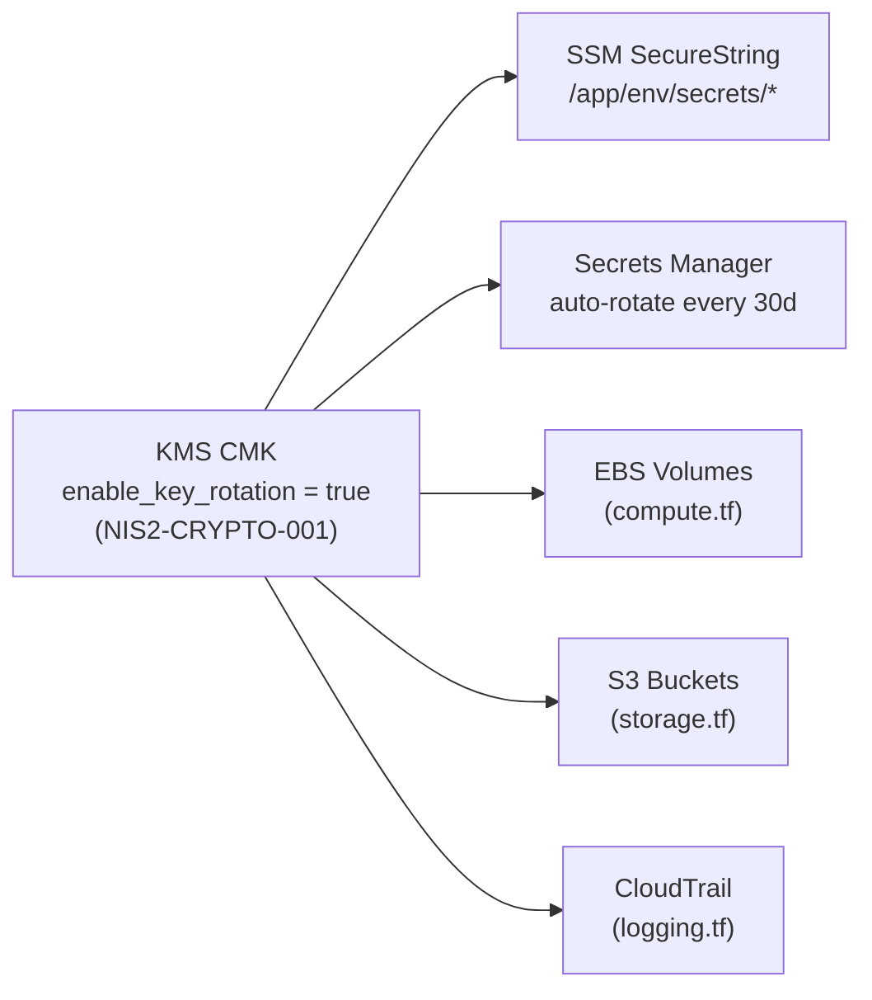

# Terraform Infrastructure Module

!!! note "Auto-generated"
    The input/output tables below are generated by **terraform-docs** from
    `terraform/variables.tf` and `terraform/outputs.tf`.  Do not edit this
    page manually — it is overwritten on every pipeline run.

## Overview

This module uses the Terraform `local` provider to demonstrate the full
deterministic documentation pipeline without requiring cloud credentials.
In a real deployment, replace the `local_file` resources with equivalent
AWS / Azure / GCP resources while keeping the variable and output contracts
identical.

## Module Files

| File | Purpose | OPA / Compliance |
|------|---------|-----------------|
| `main.tf` | App config, deployment manifest, FinOps tags | FINOPS-001 |
| `network.tf` | VPC, subnets, NSG rules, DNS records, network topology doc | SEC-002, SEC-004 |
| `storage.tf` | S3 buckets — encrypted, versioned, no public access | SEC-001, SEC-002 |
| `iam.tf` | IAM roles, least-privilege policies, instance profiles | SEC-003 |
| `monitoring.tf` | CloudWatch alarms, dashboards, log delivery | OPS-001, OPS-002 |
| `kms.tf` | KMS CMK with rotation, SSM SecureString, Secrets Manager | NIS2-CRYPTO-001 |
| `compute.tf` | EC2 Auto Scaling, launch template (IMDSv2, encrypted EBS) | SEC-001, SEC-002 |
| `logging.tf` | CloudTrail + log file validation, CloudWatch retention | DORA-ICT-001 |
| `variables.tf` | All input variable declarations with validation rules | — |
| `outputs.tf` | All output value declarations | — |

## New in This Revision

### `kms.tf` — Encryption Key Management

Provides the encryption foundation for all other resources:



| Resource | NIS2 / DORA Control |
|----------|---------------------|
| `aws_kms_key` with `enable_key_rotation = true` | NIS2-CRYPTO-001, Art.21(2)(h) |
| `aws_ssm_parameter` type `SecureString` | NIS2-CRYPTO-001 |
| `aws_secretsmanager_secret` with rotation | DORA Art.9 |

### `compute.tf` — Hardened EC2 Auto Scaling

```
Launch Template
├── IMDSv2 (http_tokens = required, hop_limit = 1)   → mitigates SSRF
├── EBS encrypted with CMK                            → SEC-001
├── No public IP (private subnets only)               → SEC-002
└── User-data bootstraps monitoring agent + PowerShell
```

Auto Scaling Group: min=1, desired=2, max=4 (configurable), lifecycle hooks for graceful drain.

### `logging.tf` — CloudTrail + CloudWatch (DORA-ICT-001)

Three DORA-ICT-001 automated controls:

| Terraform Resource | DORA-ICT-001 Rule | DORA Article |
|--------------------|------------------|--------------|
| `aws_cloudtrail.enable_log_file_validation = true` | CloudTrail log integrity | Art.9/10 |
| `aws_cloudwatch_log_group.retention_in_days > 0` | Log lifecycle governance | Art.10/15 |
| `aws_s3_bucket_versioning.status = "Enabled"` | Audit-log backup | Art.12 |

Auto-generates `docs/generated/logging-summary.md` with evidence tables.

## Resources

| Resource | Type | Description |
|----------|------|-------------|
| `local_file.app_config` | `local_file` | Application configuration JSON |
| `local_file.deployment_manifest` | `local_file` | Kubernetes deployment manifest YAML |
| `local_file.network_topology` | `local_file` | Network topology JSON |
| `local_file.network_security_rules` | `local_file` | NSG rules JSON |
| `local_file.kms_key` | `local_file` | KMS key definition (rotation enabled) |
| `local_file.ssm_parameters` | `local_file` | SSM Parameter Store manifest |
| `local_file.secrets_manager` | `local_file` | Secrets Manager manifest |
| `local_file.launch_template` | `local_file` | EC2 launch template (IMDSv2 + encrypted EBS) |
| `local_file.auto_scaling_group` | `local_file` | Auto Scaling group manifest |
| `local_file.cloudtrail` | `local_file` | CloudTrail with log file validation |
| `local_file.cloudwatch_log_groups` | `local_file` | CloudWatch log groups with retention |
| `local_file.security_alarms` | `local_file` | CloudWatch security metric alarms |

## Auto-Generated Documentation

Terraform also writes Markdown summaries directly to `docs/generated/`:

| File | Generated by | Content |
|------|-------------|---------|
| `network-topology.md` | `network.tf` | Subnet table, NSG rules |
| `kms-summary.md` | `kms.tf` | Key aliases, SSM paths, compliance table |
| `compute-summary.md` | `compute.tf` | Launch template, ASG, security controls |
| `logging-summary.md` | `logging.tf` | CloudTrail, CW log groups, DORA evidence |

<!-- BEGIN_TF_DOCS -->
<!-- terraform-docs inserts content here during the pipeline run -->
<!-- END_TF_DOCS -->
