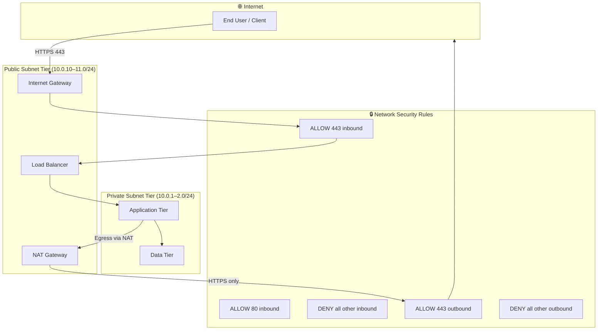
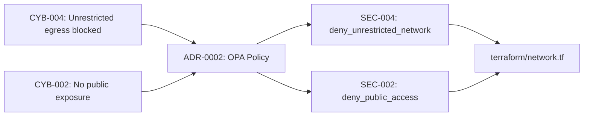

# Network Infrastructure

This chapter documents the **network topology and security posture** of the
platform.  The content here is auto-generated from Terraform source during
the CI/CD pipeline — the single source of truth is `terraform/network.tf`.

!!! info "How this page is generated"
    During `terraform plan`, Terraform creates `output/network-topology.json`
    and `output/network-security-rules.json`, and writes
    `docs/generated/network-topology.md` containing the tables below.
    MkDocs then includes that file in the "Generated" section.

---

## Network Architecture

---

## Subnet Allocation

| Subnet Name | CIDR | Role | Purpose |
|-------------|------|------|---------|
| `public-1` | `10.0.10.0/24` | Public | Load balancer, NAT gateway (AZ-1) |
| `public-2` | `10.0.11.0/24` | Public | Load balancer, NAT gateway (AZ-2) |
| `private-1` | `10.0.1.0/24` | Private | Application tier (AZ-1) |
| `private-2` | `10.0.2.0/24` | Private | Application tier (AZ-2) |

> All subnets use RFC-1918 private CIDR ranges — enforced by OPA policy
> [SEC-004](../compliance/opa-policies.md#sec-004--deny-unrestricted-network-egress).

---

## Network Security Rules

The baseline network security group (NSG) implements a **default-deny** posture:
only the traffic explicitly listed below is permitted.

### Inbound Rules

| Priority | Rule ID | Protocol | Port | Source | Action |
|----------|---------|----------|------|--------|--------|
| 100 | `ALLOW-HTTPS-INBOUND` | TCP | 443 | `0.0.0.0/0` | ✅ Allow |
| 110 | `ALLOW-HTTP-INBOUND` | TCP | 80 | `0.0.0.0/0` | ✅ Allow |
| 4096 | `DENY-ALL-INBOUND` | `*` | `*` | `0.0.0.0/0` | ❌ Deny |

> Ports 22 (SSH) and 3389 (RDP) are never open to the internet —
> enforced by [SEC-002](../compliance/opa-policies.md#sec-002--deny-publicly-exposed-resources).

### Outbound Rules

| Priority | Rule ID | Protocol | Port | Destination | Action |
|----------|---------|----------|------|-------------|--------|
| 100 | `ALLOW-HTTPS-OUTBOUND` | TCP | 443 | `0.0.0.0/0` | ✅ Allow |
| 4096 | `DENY-ALL-OUTBOUND` | `*` | `*` | `0.0.0.0/0` | ❌ Deny |

> Unrestricted outbound (`-1` / all ports to `0.0.0.0/0`) is prohibited —
> enforced by [SEC-004](../compliance/opa-policies.md#sec-004--deny-unrestricted-network-egress).

---

## OPA Network Policies

| Policy ID | Severity | What It Enforces |
|-----------|----------|-----------------|
| [SEC-002](../compliance/opa-policies.md#sec-002--deny-publicly-exposed-resources) | CRITICAL | No SSH/RDP/DB ports open to `0.0.0.0/0` |
| [SEC-004](../compliance/opa-policies.md#sec-004--deny-unrestricted-network-egress) | HIGH | No unrestricted outbound; subnets must use RFC-1918 CIDRs |

---

## Auto-Generated Network Manifest

The live network topology manifest (updated on every `terraform plan`) is
available at:

- **Topology JSON** — `terraform/output/network-topology.json`
- **Security rules JSON** — `terraform/output/network-security-rules.json`
- **DNS records JSON** — `terraform/output/dns-records.json`
- **Rendered Markdown** — [Generated: Network Topology](../generated/network-topology.md)

---

## Traceability

