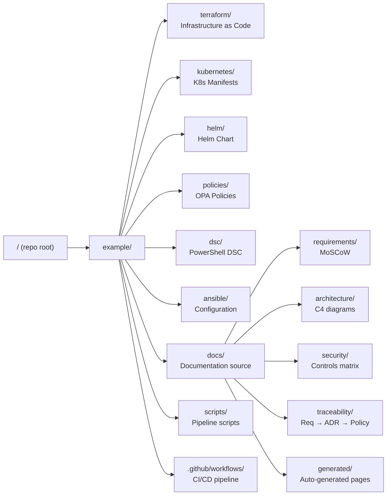

# Developer Onboarding Guide

Welcome to the **deterministic documentation platform**.  This guide gets a
new developer from zero to a running local environment in under 15 minutes.

!!! tip "Core Principle"
    Everything you need is in this repository.  There are no hidden wikis,
    tribal knowledge, or "ask someone" steps.  If something is missing, that
    is a documentation bug — open a PR.

---

## Prerequisites

| Tool | Minimum Version | Install Command |
|------|----------------|-----------------|
| Docker | 24.x | [docs.docker.com](https://docs.docker.com/get-docker/) |
| Git | 2.40+ | `apt install git` / `brew install git` |
| VSCode (optional) | 1.85+ | [code.visualstudio.com](https://code.visualstudio.com/) |

All other tools (Terraform, OPA, PowerShell, MkDocs, Pester) are bundled
inside the Docker toolchain image defined in `Dockerfile`.

---

## Step-by-Step Setup

### 1 — Clone the Repository

```bash
git clone https://github.com/DevelApp-ai/deterministic-technical-design-specification.git
cd deterministic-technical-design-specification
```

### 2 — Build the Toolchain Image

```bash
docker build -f example/Dockerfile -t dtds-example example/
```

This image contains every tool pinned to an exact version.  You only need to
rebuild when `Dockerfile` changes.

### 3 — Run the Full Documentation Pipeline Locally

```bash
docker run --rm \
  -v "$(pwd)":/workspace \
  -w /workspace/example \
  dtds-example \
  bash scripts/generate-docs.sh
```

Expected output:
```
[Step 1/7] terraform-docs ...  ✓
[Step 2/7] DSC doc-gen     ...  ✓
[Step 3/7] Ansible facts   ...  ✓
[Step 4/7] Network topology...  ✓
[Step 5/7] Changelog gen   ...  ✓
[Step 6/7] mkdocs build    ...  ✓
[Step 7/7] Doc coverage    ...  ✓
```

### 4 — Serve Docs Locally

```bash
docker run --rm \
  -p 8000:8000 \
  -v "$(pwd)":/workspace \
  -w /workspace/example \
  dtds-example \
  mkdocs serve --dev-addr 0.0.0.0:8000
```

Open <http://localhost:8000> in your browser.

### 5 — Run All Tests

```bash
# OPA policy unit tests
docker run --rm -v "$(pwd)":/workspace dtds-example \
  opa test example/policies/ -v

# Pester DSC unit tests
docker run --rm -v "$(pwd)":/workspace dtds-example \
  pwsh -Command "Invoke-Pester example/dsc/tests/ -Output Detailed"
```

---

## Repository Map



---

## Making Your First Change

**Adding a new Terraform variable**

1. Add the variable to `terraform/variables.tf`
2. Update `docs/infrastructure/terraform.md` (required by **DOC-TF** gate)
3. Run `terraform-docs markdown table example/terraform/` to preview the updated README
4. Open a PR — the CI `doc-coverage` job verifies rule DOC-TF is satisfied

**Adding a new OPA policy**

1. Create `policies/terraform/deny_<name>.rego` with a `__rego__metadoc__` block
2. Create `policies/terraform/deny_<name>_test.rego` with ≥ 1 test per rule
3. Update `docs/compliance/opa-policies.md` and `docs/security/index.md`
4. Run `opa test policies/ -v` to verify 100 % rule coverage
5. Open a PR — the CI `doc-coverage` job verifies rule DOC-OPA is satisfied

---

## Commit Message Format

This project uses [Conventional Commits](https://www.conventionalcommits.org/):

```
feat(terraform): add cost_center tag validation to deny_missing_tags
fix(docs): correct network subnet CIDR in topology table
docs(onboarding): add step for Kubernetes manifest testing
chore(ci): pin git-cliff to v2.4.0
```

The CI `release` job uses these messages to auto-generate `CHANGELOG.md`.

---

## Getting Help

| Resource | Where |
|----------|-------|
| Architecture overview | [Architecture & C4](../architecture/index.md) |
| Operational runbook | [Runbook](../runbook/index.md) |
| Requirements | [MoSCoW](../requirements/moscow.md) |
| ADRs (decision log) | [Architecture Decisions](../adrs/0001-use-terraform-for-iac.md) |
| Doc coverage rules | [Doc Review Gate](../doc-review/index.md) |
| Traceability | [Traceability Matrix](../traceability/index.md) |
