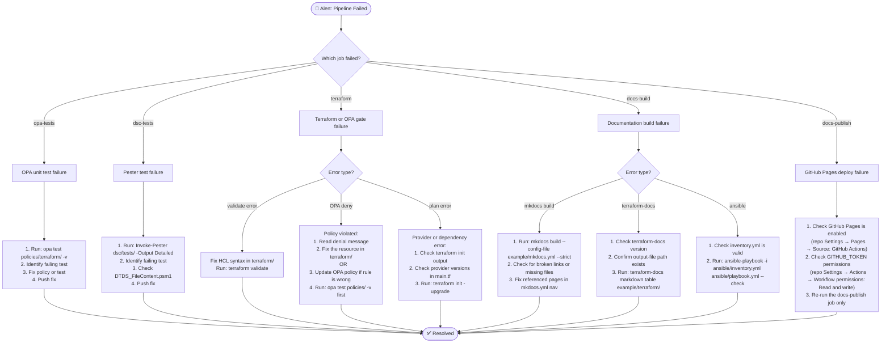

# Operational Runbook

This runbook covers the **day-2 operational procedures** for the deterministic
documentation platform.  It is the DevOps team's first reference for incidents,
deployments, and routine maintenance.

!!! tip "Principle"
    Every procedure in this runbook is executable from the Docker toolchain
    image — no host tool installation required.

---

## Quick Reference

| Action | Command |
|--------|---------|
| Run full doc pipeline locally | `docker run --rm -v "$(pwd)":/workspace dtds-example scripts/generate-docs.sh` |
| Serve docs locally | `docker run --rm -p 8000:8000 -v "$(pwd)":/workspace dtds-example mkdocs serve -f example/mkdocs.yml --dev-addr 0.0.0.0:8000` |
| Run OPA policy tests | `docker run --rm -v "$(pwd)":/workspace dtds-example opa test example/policies/terraform/ -v` |
| Run Pester DSC tests | `docker run --rm -v "$(pwd)":/workspace dtds-example pwsh -Command "Invoke-Pester example/dsc/tests/ -Output Detailed"` |
| Validate Terraform | `docker run --rm -v "$(pwd)":/workspace dtds-example bash -c "cd example/terraform && terraform init && terraform validate"` |
| Generate DSC docs | `docker run --rm -v "$(pwd)":/workspace dtds-example pwsh -File example/dsc/build.ps1` |

---

## CI/CD Pipeline Operations

### Re-triggering a Failed Pipeline

```bash
# Manually trigger the workflow (requires gh CLI)
gh workflow run docs-pipeline.yml --ref main

# Or push an empty commit to re-trigger on push
git commit --allow-empty -m "chore: re-trigger pipeline"
git push
```

### Viewing Pipeline Logs

```bash
# List recent workflow runs
gh run list --workflow docs-pipeline.yml --limit 10

# View logs for a specific run
gh run view <RUN_ID> --log
```

---

## Incident Response

The following flowchart covers the most common failure scenarios.



---

## Routine Maintenance Procedures

### Updating Tool Versions

All tool versions are pinned in the `Dockerfile`.  To upgrade:

1. Update the `ARG` value in `example/Dockerfile`
2. Build and test locally: `docker build -t dtds-example example/`
3. Run the smoke test: `docker run --rm dtds-example` (prints tool versions)
4. Run the full pipeline: `docker run --rm -v "$(pwd)":/workspace dtds-example scripts/generate-docs.sh`
5. Update the version references in `docs/architecture/index.md` (technology radar)
6. Open a PR with `chore: bump <tool> to <version>`

### Adding a New OPA Policy

1. Create `policies/terraform/deny_<name>.rego` using `import rego.v1`
2. Set `__rego__metadoc__` with `related_adr`, `related_requirements`, and `compliance` fields
3. Create `policies/terraform/deny_<name>_test.rego` with 100% rule coverage
4. Run `opa test policies/terraform/ -v` — all tests must pass
5. Add the policy to `docs/compliance/opa-policies.md`
6. Add the policy to the security controls matrix in `docs/security/index.md`
7. Update `docs/requirements/moscow.md` if a new requirement is being implemented
8. Update `docs/traceability/index.md` diagrams

### Adding a New DSC Resource

1. Create `dsc/resources/<Name>/<Name>.psm1` with class-based DSC resource
2. Create `dsc/resources/<Name>/<Name>.psd1` module manifest
3. Add Pester 5 tests in `dsc/tests/<Name>.Tests.ps1` using `InModuleScope`
4. Run `pwsh -Command "Invoke-Pester dsc/tests/ -Output Detailed"` — all tests must pass
5. `dsc/build.ps1` will auto-generate the documentation page on next CI run
6. Add a nav entry in `mkdocs.yml` if the resource needs a dedicated page

### Adding a New ADR

1. Create `docs/adrs/<number>-<slug>.md` with YAML front-matter including:
   - `id`, `title`, `status`, `date`, `related_requirements`
2. Update `mkdocs.yml` nav — Architecture Decisions section
3. Update `docs/traceability/index.md` — add the ADR to the matrix tables

---

## Health Check Checklist

Run this checklist before any production deployment:

- [ ] `opa test example/policies/terraform/ -v` — all policy tests pass
- [ ] `pwsh -Command "Invoke-Pester example/dsc/tests/ -Output Detailed"` — all DSC tests pass
- [ ] `terraform -chdir=example/terraform validate` — no validation errors
- [ ] `mkdocs build --config-file example/mkdocs.yml --strict` — no warnings or errors
- [ ] `docker build -t dtds-example example/` — image builds cleanly
- [ ] GitHub Actions pipeline shows green on `main` branch

---

## Escalation Matrix

| Severity | Symptom | Owner | SLA |
|----------|---------|-------|-----|
| P1 | OPA gate blocking all PRs | DevOps Lead | 1 hour |
| P1 | GitHub Pages site unavailable | DevOps Lead | 1 hour |
| P2 | Policy false positive blocking valid PR | Security Engineer | 4 hours |
| P2 | Pester tests failing on main | DevOps Engineer | 4 hours |
| P3 | Documentation stale (>24h) | DevOps Engineer | 24 hours |
| P4 | Tool version outdated | Any engineer | Next sprint |
