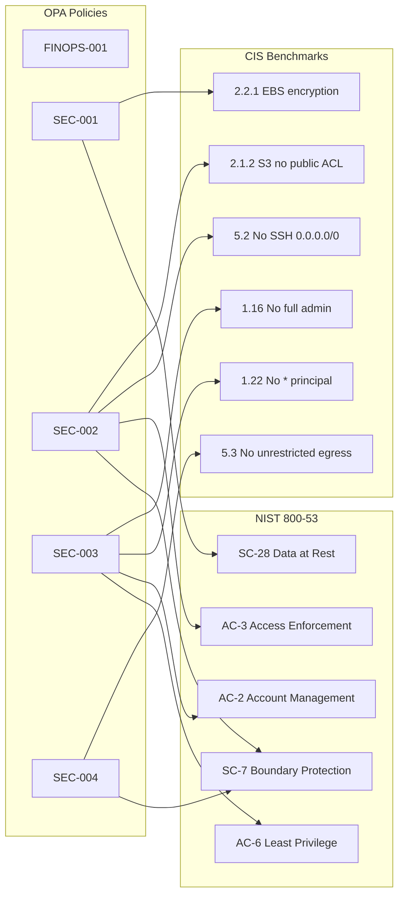

# Security Controls

This page provides the **security controls matrix** — a mapping from every
OPA policy in the repository to the specific controls in recognised compliance
frameworks that the policy satisfies.

It answers the cybersecurity team's key question:
*"Which automated gates enforce which compliance controls, and which ADR
mandated them?"*

---

## Policy → Framework Mapping

| Policy ID | Severity | Package | CIS AWS/Azure | NIST 800-53 | SOC 2 CC | Related ADR | Related Requirements |
|-----------|----------|---------|---------------|-------------|----------|-------------|---------------------|
| [FINOPS-001](#finops-001) | HIGH | `terraform.finops` | — | CM-8, CM-9 | CC1.2 | [ADR-0002](../adrs/0002-use-opa-for-policy.md) | M-002, M-003, S-001, S-002 |
| [SEC-001](#sec-001) | CRITICAL | `terraform.security` | CIS AWS 2.2.1, 2.4 | SC-28, CP-9 | CC6.1 | [ADR-0002](../adrs/0002-use-opa-for-policy.md) | M-003, S-001 |
| [SEC-002](#sec-002) | CRITICAL | `terraform.security` | CIS AWS 2.1.2, 5.2 | AC-3, SC-7 | CC6.1, CC6.6 | [ADR-0002](../adrs/0002-use-opa-for-policy.md) | M-003, S-001, CYB-002 |
| [SEC-003](#sec-003) | HIGH | `terraform.iam` | CIS AWS 1.16, 1.22 | AC-2, AC-6, IA-2 | CC6.3 | [ADR-0002](../adrs/0002-use-opa-for-policy.md) | M-003, S-001, CYB-003 |
| [SEC-004](#sec-004) | HIGH | `terraform.network` | CIS AWS 5.3, 5.4 | SC-7, CA-3 | CC6.6, CC6.7 | [ADR-0002](../adrs/0002-use-opa-for-policy.md) | M-003, S-001, CYB-004 |

---

## Control Framework Coverage



---

## Policy Details

### FINOPS-001

**Package:** `terraform.finops`  
**Severity:** HIGH  
**File:** `policies/terraform/deny_missing_tags.rego`

**What it enforces:** Every Terraform resource must carry the four mandatory
cost-allocation tags (`environment`, `app_name`, `owner`, `cost_center`).

**Why it matters:** Without tags, cloud expenditure cannot be attributed to
a team or project (FinOps) and the asset inventory (CM-8) is incomplete.

| Framework | Control | Description |
|-----------|---------|-------------|
| NIST 800-53 | CM-8 | Information System Component Inventory |
| NIST 800-53 | CM-9 | Configuration Management Plan |
| SOC 2 | CC1.2 | Board demonstrates commitment to integrity |

---

### SEC-001

**Package:** `terraform.security`  
**Severity:** CRITICAL  
**File:** `policies/terraform/deny_unencrypted_storage.rego`

**What it enforces:** Storage resources must not have encryption disabled.

| Framework | Control | Description |
|-----------|---------|-------------|
| CIS AWS | 2.2.1 | Ensure EBS volume encryption is enabled |
| CIS AWS | 2.4 | Ensure all S3 buckets employ encryption |
| NIST 800-53 | SC-28 | Protection of Information at Rest |
| NIST 800-53 | CP-9 | Information System Backup |
| SOC 2 | CC6.1 | Logical access security measures |

---

### SEC-002

**Package:** `terraform.security`  
**Severity:** CRITICAL  
**File:** `policies/terraform/deny_public_access.rego`

**What it enforces:** Resources must not be publicly exposed on sensitive ports
(22/SSH, 3389/RDP, 5432/PostgreSQL, 1433/MSSQL, 27017/MongoDB) or via public
S3 ACLs / Azure Storage public blob access.

| Framework | Control | Description |
|-----------|---------|-------------|
| CIS AWS | 2.1.2 | Ensure S3 Bucket Policy does not allow public access |
| CIS AWS | 5.2 | Ensure no security groups allow ingress from 0.0.0.0/0 to SSH |
| CIS Azure | 3.7 | Ensure storage accounts have public access disabled |
| NIST 800-53 | AC-3 | Access Enforcement |
| NIST 800-53 | SC-7 | Boundary Protection |
| SOC 2 | CC6.1 | Logical access security |
| SOC 2 | CC6.6 | Logical access security — external users |

---

### SEC-003

**Package:** `terraform.iam`  
**Severity:** HIGH  
**File:** `policies/terraform/deny_public_iam.rego`

**What it enforces:** IAM policies must not use wildcard principals (`*`) in
trust policies or wildcard actions (`*`, `iam:*`, `kms:*`, etc.) in permission
policies.  Principle of least privilege.

| Framework | Control | Description |
|-----------|---------|-------------|
| CIS AWS | 1.16 | Ensure IAM policies are attached only to groups or roles |
| CIS AWS | 1.22 | Ensure IAM policies that allow full admin privileges are not created |
| NIST 800-53 | AC-2 | Account Management |
| NIST 800-53 | AC-6 | Least Privilege |
| NIST 800-53 | IA-2 | Identification and Authentication |
| SOC 2 | CC6.3 | Role-based access controls |

---

### SEC-004

**Package:** `terraform.network`  
**Severity:** HIGH  
**File:** `policies/terraform/deny_unrestricted_network.rego`

**What it enforces:** Network security rules must not allow all outbound traffic
(unrestricted egress). Subnets must use RFC-1918 private CIDR ranges.

| Framework | Control | Description |
|-----------|---------|-------------|
| CIS AWS | 5.3 | Ensure no security groups allow unrestricted outbound traffic |
| CIS AWS | 5.4 | Ensure the default security group restricts all traffic |
| CIS Azure | 6.2 | Ensure no NSG allows unrestricted outbound |
| NIST 800-53 | SC-7 | Boundary Protection |
| NIST 800-53 | CA-3 | System Interconnections |
| SOC 2 | CC6.6 | Logical access security |
| SOC 2 | CC6.7 | Transmission of data — encryption and network controls |

---

## Gap Analysis

The table below lists compliance controls that are **not yet automated** by
an OPA policy, providing a roadmap for the security team.

| Framework | Control | Description | Status |
|-----------|---------|-------------|--------|
| CIS AWS | 2.3.1 | RDS encryption at rest | ⚠️ Not automated — add `deny_unencrypted_rds.rego` |
| CIS AWS | 3.1 | CloudTrail enabled | ⚠️ Not automated — requires AWS account context |
| NIST 800-53 | AU-2 | Audit Events | ⚠️ Not automated — logging policy needed |
| NIST 800-53 | IR-4 | Incident Handling | ✅ Covered by runbook |
| SOC 2 | CC7.1 | System monitoring | ⚠️ Not automated — monitoring config needed |
| PCI-DSS | Req 6.3 | Vulnerability scanning | ⚠️ Not automated — SAST/SCA pipeline needed |

---

## Running a Full Compliance Check Locally

```bash
# Evaluate all policies against a plan file
opa eval \
  --data example/policies/terraform/ \
  --input example/docs/generated/plan.json \
  --format pretty \
  'data.terraform.finops.deny |
   data.terraform.security.deny |
   data.terraform.iam.deny |
   data.terraform.network.deny'

# Run all policy unit tests
opa test example/policies/terraform/ -v
```
