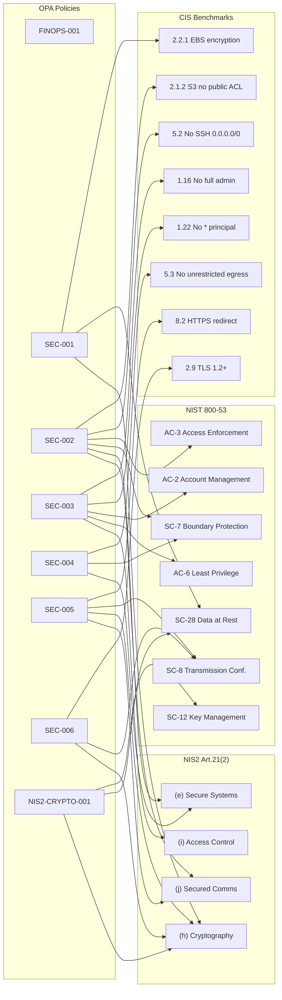

# Security Controls

This page provides the **security controls matrix** — a mapping from every
OPA policy in the repository to the specific controls in recognised compliance
frameworks that the policy satisfies.

It answers the cybersecurity team's key question:
*"Which automated gates enforce which compliance controls, and which ADR
mandated them?"*

---

## Policy → Framework Mapping

| Policy ID | Severity | Package | NIS2 | DORA | CIS AWS/Azure | NIST 800-53 | SOC 2 CC | Related ADR | Related Requirements |
|-----------|----------|---------|------|------|---------------|-------------|----------|-------------|---------------------|
| [FINOPS-001](#finops-001) | HIGH | `terraform.finops` | Art.21(2)(i) | Art.8 | — | CM-8, CM-9 | CC1.2 | [ADR-0002](../adrs/0002-use-opa-for-policy.md) | M-002, M-003 |
| [SEC-001](#sec-001) | CRITICAL | `terraform.security` | Art.21(2)(h) | Art.9 | CIS AWS 2.2.1, 2.4 | SC-28, CP-9 | CC6.1 | [ADR-0002](../adrs/0002-use-opa-for-policy.md) | M-003, S-001 |
| [SEC-002](#sec-002) | CRITICAL | `terraform.security` | Art.21(2)(e), (j) | Art.9 | CIS AWS 2.1.2, 5.2 | AC-3, SC-7 | CC6.1, CC6.6 | [ADR-0002](../adrs/0002-use-opa-for-policy.md) | M-003, CYB-002 |
| [SEC-003](#sec-003) | HIGH | `terraform.iam` | Art.21(2)(i) | Art.9 | CIS AWS 1.16, 1.22 | AC-2, AC-6, IA-2 | CC6.3 | [ADR-0002](../adrs/0002-use-opa-for-policy.md) | M-003, CYB-003 |
| [SEC-004](#sec-004) | HIGH | `terraform.network` | Art.21(2)(e) | Art.9 | CIS AWS 5.3, 5.4 | SC-7, CA-3 | CC6.6, CC6.7 | [ADR-0002](../adrs/0002-use-opa-for-policy.md) | M-003, CYB-004 |
| [SEC-005](#sec-005) | HIGH | `terraform.https` | Art.21(2)(h), (j) | Art.9 | CIS AWS 8.2 | SC-8, SC-23 | CC6.7 | [ADR-0002](../adrs/0002-use-opa-for-policy.md) | M-003, CYB-002 |
| [SEC-006](#sec-006) | HIGH | `terraform.tls` | Art.21(2)(h) | Art.9 | CIS AWS 2.9, Azure 9.3 | SC-8, SC-23, IA-7 | CC6.7, CC6.8 | [ADR-0002](../adrs/0002-use-opa-for-policy.md) | M-003, CYB-002 |
| [NIS2-CRYPTO-001](#nis2-crypto-001) | HIGH | `terraform.nis2` | Art.21(2)(h) | Art.9 | — | SC-12, SC-28 | CC6.1, CC6.7 | [ADR-0010](../adrs/0010-nis2-compliance.md) | NIS2-002, M-003 |
| [DORA-ICT-001](#dora-ict-001) | HIGH | `terraform.dora` | — | Art.9, Art.10, Art.12 | — | AU-2, AU-9, CP-9 | CC7.2, A1.2 | [ADR-0011](../adrs/0011-dora-compliance.md) | DORA-002, DORA-003 |

---

## Control Framework Coverage



---

## Policy Details

### FINOPS-001

**Package:** `terraform.finops`  
**Severity:** HIGH  
**File:** `policies/terraform/deny_missing_tags.rego`

**What it enforces:** Every Terraform resource must carry the four mandatory
cost-allocation tags (`environment`, `app_name`, `owner`, `cost_center`).

**Why it matters:** Without tags, cloud expenditure cannot be attributed to
a team or project (FinOps) and the asset inventory (CM-8) is incomplete.

| Framework | Control | Description |
|-----------|---------|-------------|
| NIST 800-53 | CM-8 | Information System Component Inventory |
| NIST 800-53 | CM-9 | Configuration Management Plan |
| SOC 2 | CC1.2 | Board demonstrates commitment to integrity |

---

### SEC-001

**Package:** `terraform.security`  
**Severity:** CRITICAL  
**File:** `policies/terraform/deny_unencrypted_storage.rego`

**What it enforces:** Storage resources must not have encryption disabled.

| Framework | Control | Description |
|-----------|---------|-------------|
| CIS AWS | 2.2.1 | Ensure EBS volume encryption is enabled |
| CIS AWS | 2.4 | Ensure all S3 buckets employ encryption |
| NIST 800-53 | SC-28 | Protection of Information at Rest |
| NIST 800-53 | CP-9 | Information System Backup |
| SOC 2 | CC6.1 | Logical access security measures |

---

### SEC-002

**Package:** `terraform.security`  
**Severity:** CRITICAL  
**File:** `policies/terraform/deny_public_access.rego`

**What it enforces:** Resources must not be publicly exposed on sensitive ports
(22/SSH, 3389/RDP, 5432/PostgreSQL, 1433/MSSQL, 27017/MongoDB) or via public
S3 ACLs / Azure Storage public blob access.

| Framework | Control | Description |
|-----------|---------|-------------|
| CIS AWS | 2.1.2 | Ensure S3 Bucket Policy does not allow public access |
| CIS AWS | 5.2 | Ensure no security groups allow ingress from 0.0.0.0/0 to SSH |
| CIS Azure | 3.7 | Ensure storage accounts have public access disabled |
| NIST 800-53 | AC-3 | Access Enforcement |
| NIST 800-53 | SC-7 | Boundary Protection |
| SOC 2 | CC6.1 | Logical access security |
| SOC 2 | CC6.6 | Logical access security — external users |

---

### SEC-003

**Package:** `terraform.iam`  
**Severity:** HIGH  
**File:** `policies/terraform/deny_public_iam.rego`

**What it enforces:** IAM policies must not use wildcard principals (`*`) in
trust policies or wildcard actions (`*`, `iam:*`, `kms:*`, etc.) in permission
policies.  Principle of least privilege.

| Framework | Control | Description |
|-----------|---------|-------------|
| CIS AWS | 1.16 | Ensure IAM policies are attached only to groups or roles |
| CIS AWS | 1.22 | Ensure IAM policies that allow full admin privileges are not created |
| NIST 800-53 | AC-2 | Account Management |
| NIST 800-53 | AC-6 | Least Privilege |
| NIST 800-53 | IA-2 | Identification and Authentication |
| SOC 2 | CC6.3 | Role-based access controls |

---

### SEC-004

**Package:** `terraform.network`  
**Severity:** HIGH  
**File:** `policies/terraform/deny_unrestricted_network.rego`

**What it enforces:** Network security rules must not allow all outbound traffic
(unrestricted egress). Subnets must use RFC-1918 private CIDR ranges.

| Framework | Control | Description |
|-----------|---------|-------------|
| NIS2 | Art.21(2)(e) | Security in acquisition, development and maintenance of network and information systems |
| CIS AWS | 5.3 | Ensure no security groups allow unrestricted outbound traffic |
| CIS AWS | 5.4 | Ensure the default security group restricts all traffic |
| CIS Azure | 6.2 | Ensure no NSG allows unrestricted outbound |
| NIST 800-53 | SC-7 | Boundary Protection |
| NIST 800-53 | CA-3 | System Interconnections |
| SOC 2 | CC6.6 | Logical access security |
| SOC 2 | CC6.7 | Transmission of data — encryption and network controls |

---

### SEC-005

**Package:** `terraform.https`  
**Severity:** HIGH  
**File:** `policies/terraform/deny_missing_https_redirect.rego`

**What it enforces:** Public HTTP (port 80) listeners must redirect to HTTPS.
Plain-text HTTP is prohibited on internet-facing endpoints.

| Framework | Control | Description |
|-----------|---------|-------------|
| NIS2 | Art.21(2)(h) | Cryptography and encryption — encryption in transit |
| NIS2 | Art.21(2)(j) | Secured communications |
| CIS AWS | 8.2 | Ensure ALB HTTPS redirect is configured |
| NIST 800-53 | SC-8 | Transmission Confidentiality and Integrity |
| NIST 800-53 | SC-23 | Session Authenticity |
| SOC 2 | CC6.7 | Transmission of data |

---

### SEC-006

**Package:** `terraform.tls`  
**Severity:** HIGH  
**File:** `policies/terraform/deny_deprecated_tls.rego`

**What it enforces:** TLS 1.0 and TLS 1.1 are prohibited. Only TLS 1.2+ is
allowed on internet-facing and internal endpoints.

| Framework | Control | Description |
|-----------|---------|-------------|
| NIS2 | Art.21(2)(h) | Cryptography — prohibit weak algorithms |
| CIS AWS | 2.9 | Ensure CloudFront uses TLS 1.2+ |
| CIS Azure | 9.3 | Ensure App Gateway uses TLS 1.2+ |
| NIST 800-53 | SC-8 | Transmission Confidentiality |
| NIST 800-53 | SC-23 | Session Authenticity |
| NIST 800-53 | IA-7 | Cryptographic Module Authentication |
| SOC 2 | CC6.7 | Transmission of data |
| SOC 2 | CC6.8 | Cryptographic controls |

---

### NIS2-CRYPTO-001

**Package:** `terraform.nis2`  
**Severity:** HIGH  
**File:** `policies/terraform/deny_nis2_crypto.rego`

**What it enforces:**

1. **KMS key rotation** — AWS KMS keys must have `enable_key_rotation = true`
2. **RDS encryption** — AWS RDS instances must have `storage_encrypted = true`
3. **No plaintext secrets** — SSM parameters with secret-like names must use `SecureString`

| Framework | Control | Description |
|-----------|---------|-------------|
| NIS2 | Art.21(2)(h) | Cryptography policies — key management and data encryption |
| NIST 800-53 | SC-12 | Cryptographic Key Establishment and Management |
| NIST 800-53 | SC-28 | Protection of Information at Rest |
| NIST 800-53 | SC-13 | Cryptographic Protection |
| SOC 2 | CC6.1 | Logical access security measures |
| SOC 2 | CC6.7 | Transmission of data |
| GDPR | Art.32 | Security of processing — encryption of personal data |

---

### DORA-ICT-001

**Package:** `terraform.dora`  
**Severity:** HIGH  
**File:** `policies/terraform/deny_dora_ict_risk.rego`

**What it enforces:** Three ICT risk-management controls mandated by DORA
Chapter II — ICT Risk Management (Art. 5–16):

1. CloudTrail `enable_log_file_validation = true` — log integrity
2. CloudWatch log group `retention_in_days > 0` — log lifecycle governance
3. S3 bucket versioning `status = "Enabled"` — point-in-time backup recovery

| Framework | Control | Description |
|-----------|---------|-------------|
| DORA | Art.9 | Protection and Prevention — ICT security policies |
| DORA | Art.10 | Detection — anomaly detection and logging |
| DORA | Art.12 | Backup Policies and Procedures |
| NIST 800-53 | AU-2 | Audit Events |
| NIST 800-53 | AU-9 | Protection of Audit Information |
| NIST 800-53 | CP-9 | Information System Backup |
| NIST 800-53 | SI-12 | Information Management and Retention |
| SOC 2 | CC7.2 | System monitoring for anomalous activity |
| SOC 2 | A1.2 | Availability commitments — backup processing |

---

## Gap Analysis

The table below lists compliance controls that are **not yet automated** by
an OPA policy, providing a roadmap for the security team.

| Framework | Control | Description | Status |
|-----------|---------|-------------|--------|
| CIS AWS | 2.3.1 | RDS encryption at rest | ⚠️ Partially covered by NIS2-CRYPTO-001 |
| CIS AWS | 3.1 | CloudTrail enabled | ⚠️ Add `deny_cloudtrail_disabled.rego` for trail existence check |
| NIST 800-53 | AU-2 | Audit Events | ✅ Covered by DORA-ICT-001 (log validation + retention) |
| NIST 800-53 | IR-4 | Incident Handling | ✅ Covered by runbook |
| SOC 2 | CC7.1 | System monitoring | ✅ Covered by `terraform/monitoring.tf` alarms |
| PCI-DSS | Req 6.3 | Vulnerability scanning | ⚠️ Not automated — SAST/SCA pipeline needed |
| NIS2 | Art.21(2)(c) | Formal RTO/RPO targets | ⚠️ Infrastructure exists; documentation needed |
| NIS2 | Art.21(2)(d) | Supply chain / SBOM | ⚠️ Not automated — add Syft/Grype to CI |
| NIS2 | Art.21(2)(j) | MFA for human access | ⚠️ Requires IdP integration (Azure AD / Okta) |
| DORA | Art.10 | Log retention ≥ 365 days | ⚠️ DORA-ICT-001 enforces non-zero; 365-day minimum still manual |
| DORA | Art.19–20 | Incident classification thresholds | ⚠️ Add DORA incident matrix to runbook |
| DORA | Art.25 | TLPT testing programme | ⚠️ Requires accredited external provider |
| DORA | Art.28–30 | ICT third-party risk register | ⚠️ Add `docs/third-party/ict-register.md` |

See the [NIS2 compliance page](../compliance/nis2.md) for the full NIS2 gap analysis and audit checklist.
See the [DORA compliance page](../compliance/dora.md) for the full DORA gap analysis and audit checklist.

---

## Running a Full Compliance Check Locally

```bash
# Evaluate all policies against a plan file
opa eval \
  --data example/policies/terraform/ \
  --input example/docs/generated/plan.json \
  --format pretty \
  'data.terraform.finops.deny |
   data.terraform.security.deny |
   data.terraform.iam.deny |
   data.terraform.network.deny |
   data.terraform.https.deny |
   data.terraform.tls.deny |
   data.terraform.nis2.deny |
   data.terraform.dora.deny'

# Run all policy unit tests (90 tests)
opa test example/policies/terraform/ example/policies/kubernetes/ -v
```
