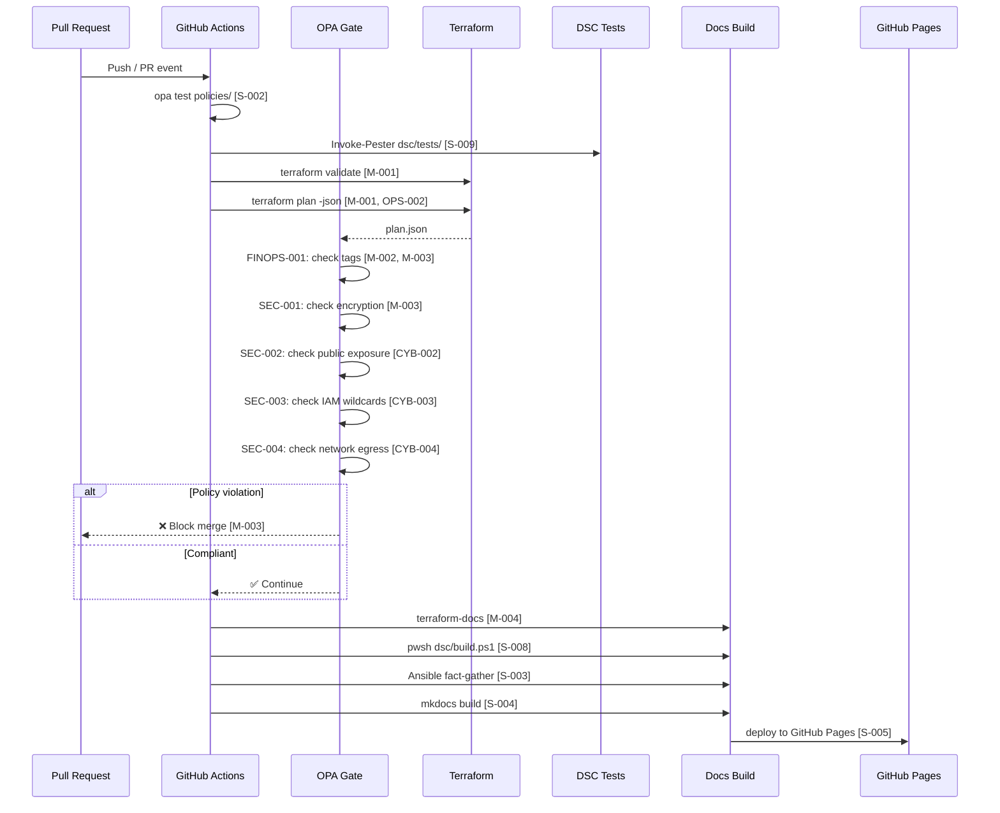
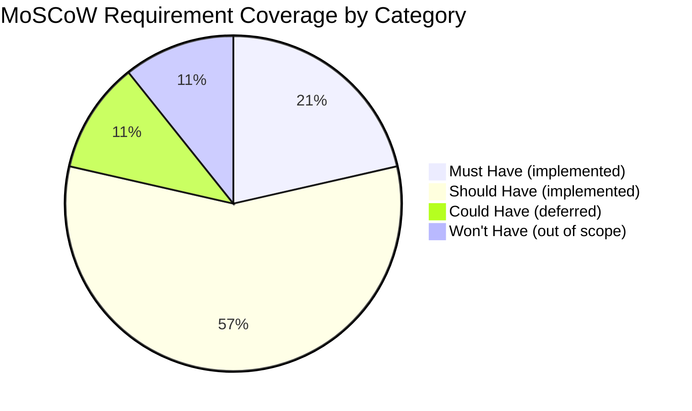

# Traceability Matrix

This page provides a **complete, bidirectional traceability map** between:

- 📋 **MoSCoW Requirements** — the business intent captured in `docs/requirements/moscow.md`
- 📖 **Architectural Decision Records** — the *why* captured in `docs/adrs/`
- 🔒 **OPA Policies** — the automated enforcement in `policies/terraform/`
- ⚙️ **Infrastructure Code** — the actual implementation in `terraform/`, `dsc/`

Every artefact in the repository carries machine-readable metadata (`related_requirements`,
`related_adr`, `__rego__metadoc__`) so that this matrix can be generated
automatically from the source code.

---

## Full Traceability Graph

The diagram below shows the complete chain from business requirement through
architectural decision to enforcement policy and infrastructure code.

```mermaid
graph TB
    subgraph MoSCoW["📋 MoSCoW Requirements"]
        direction TB
        M001["<b>M-001</b><br/>Infrastructure as Code"]
        M002["<b>M-002</b><br/>FinOps Tags Required"]
        M003["<b>M-003</b><br/>OPA Blocks Pipeline"]
        M004["<b>M-004</b><br/>Auto-generated Docs"]
        M005["<b>M-005</b><br/>ADRs Required"]
        M006["<b>M-006</b><br/>Docker Image"]
        S001["<b>S-001</b><br/>OPA Metadoc"]
        S002["<b>S-002</b><br/>OPA Unit Tests"]
        S004["<b>S-004</b><br/>Searchable ADR Index"]
        S005["<b>S-005</b><br/>GitHub Pages"]
        S008["<b>S-008</b><br/>DSC Resources"]
        S009["<b>S-009</b><br/>Pester Tests"]
        CYB002["<b>CYB-002</b><br/>No Public Exposure"]
        CYB003["<b>CYB-003</b><br/>Least-Privilege IAM"]
        CYB004["<b>CYB-004</b><br/>No Unrestricted Egress"]
        A001["<b>A-001</b><br/>C4 Architecture Diagrams"]
        OPS001["<b>OPS-001</b><br/>Operational Runbook"]
        OPS002["<b>OPS-002</b><br/>Network as Code"]
    end

    subgraph ADRs["📖 Architectural Decision Records"]
        direction TB
        ADR001["<b>ADR-0001</b><br/>Terraform for IaC<br/><i>related: M-001, M-004, M-006</i>"]
        ADR002["<b>ADR-0002</b><br/>OPA for Policy<br/><i>related: M-002, M-003, S-001, S-002</i>"]
        ADR003["<b>ADR-0003</b><br/>MkDocs for Publishing<br/><i>related: M-004, M-005, S-004, S-005</i>"]
        ADR004["<b>ADR-0004</b><br/>DSC for Windows Config<br/><i>related: M-005, S-008, S-009</i>"]
        ADR005["<b>ADR-0005</b><br/>Architecture Diagrams<br/><i>related: M-005, A-001, A-002</i>"]
    end

    subgraph Policies["🔒 OPA Policies"]
        direction TB
        FIN001["<b>FINOPS-001</b><br/>deny_missing_tags.rego<br/><i>HIGH severity</i>"]
        SEC001["<b>SEC-001</b><br/>deny_unencrypted_storage.rego<br/><i>CRITICAL severity</i>"]
        SEC002["<b>SEC-002</b><br/>deny_public_access.rego<br/><i>CRITICAL severity</i>"]
        SEC003["<b>SEC-003</b><br/>deny_public_iam.rego<br/><i>HIGH severity</i>"]
        SEC004["<b>SEC-004</b><br/>deny_unrestricted_network.rego<br/><i>HIGH severity</i>"]
    end

    subgraph IaC["⚙️ Implementation"]
        direction TB
        TF["terraform/main.tf<br/><i>local_file resources</i>"]
        NETW["terraform/network.tf<br/><i>VPC/subnet/NSG/DNS</i>"]
        SCRIPT["scripts/generate-docs.sh"]
        DOCKER["Dockerfile"]
        MKDOCS["mkdocs.yml"]
        DSC["dsc/resources/DTDS_FileContent<br/><i>class-based DSC resource</i>"]
        PSTEST["dsc/tests/DTDS_FileContent.Tests.ps1<br/><i>Pester 5 unit tests</i>"]
        DSCBLD["dsc/build.ps1<br/><i>DscResource.DocGenerator</i>"]
        ARCH["docs/architecture/index.md<br/><i>C4 diagrams + tech radar</i>"]
        RUNBOOK["docs/runbook/index.md<br/><i>Operational runbook</i>"]
    end

    M001 --> ADR001
    M004 --> ADR001
    M006 --> ADR001

    M002 --> ADR002
    M003 --> ADR002
    S001 --> ADR002
    S002 --> ADR002
    CYB002 --> ADR002
    CYB003 --> ADR002
    CYB004 --> ADR002

    M004 --> ADR003
    M005 --> ADR003
    S004 --> ADR003
    S005 --> ADR003

    M005 --> ADR004
    S008 --> ADR004
    S009 --> ADR004

    M005 --> ADR005
    A001 --> ADR005

    ADR001 --> TF
    ADR001 --> NETW
    ADR001 --> SCRIPT
    ADR001 --> DOCKER

    ADR002 --> FIN001
    ADR002 --> SEC001
    ADR002 --> SEC002
    ADR002 --> SEC003
    ADR002 --> SEC004

    ADR003 --> MKDOCS

    ADR004 --> DSC
    ADR004 --> PSTEST
    ADR004 --> DSCBLD

    ADR005 --> ARCH

    OPS001 --> RUNBOOK
    OPS002 --> NETW

    FIN001 -.->|"enforces M-002"| TF
    SEC001 -.->|"enforces M-003"| TF
    SEC002 -.->|"enforces CYB-002"| TF
    SEC002 -.->|"enforces CYB-002"| NETW
    SEC003 -.->|"enforces CYB-003"| TF
    SEC004 -.->|"enforces CYB-004"| NETW
    PSTEST -.->|"tests S-009"| DSC
```



---

## Policy → Requirement → ADR Matrix

| OPA Policy | Severity | MoSCoW Requirements | Architectural Decision |
|-----------|---------|-------------------|----------------------|
| [FINOPS-001](../compliance/opa-policies.md#finops-001--mandatory-finops-cost-allocation-tags) | HIGH | [M-002](../requirements/moscow.md#must-have), [M-003](../requirements/moscow.md#must-have), [S-001](../requirements/moscow.md#should-have), [S-002](../requirements/moscow.md#should-have) | [ADR-0002](../adrs/0002-use-opa-for-policy.md) |
| [SEC-001](../compliance/opa-policies.md#sec-001--storage-encryption-required) | CRITICAL | [M-003](../requirements/moscow.md#must-have), [S-001](../requirements/moscow.md#should-have) | [ADR-0002](../adrs/0002-use-opa-for-policy.md) |
| [SEC-002](../compliance/opa-policies.md#sec-002--deny-publicly-exposed-resources) | CRITICAL | [M-003](../requirements/moscow.md#must-have), [S-001](../requirements/moscow.md#should-have), [CYB-002](../requirements/moscow.md#should-have--cybersecurity) | [ADR-0002](../adrs/0002-use-opa-for-policy.md) |
| [SEC-003](../compliance/opa-policies.md#sec-003--deny-overly-permissive-iam) | HIGH | [M-003](../requirements/moscow.md#must-have), [S-001](../requirements/moscow.md#should-have), [CYB-003](../requirements/moscow.md#should-have--cybersecurity) | [ADR-0002](../adrs/0002-use-opa-for-policy.md) |
| [SEC-004](../compliance/opa-policies.md#sec-004--deny-unrestricted-network-egress) | HIGH | [M-003](../requirements/moscow.md#must-have), [S-001](../requirements/moscow.md#should-have), [CYB-004](../requirements/moscow.md#should-have--cybersecurity) | [ADR-0002](../adrs/0002-use-opa-for-policy.md) |

---

## ADR → Requirement → Implementation Matrix

| ADR | MoSCoW Requirements | Implementation |
|-----|--------------------|-|
| [ADR-0001](../adrs/0001-use-terraform-for-iac.md) — Terraform for IaC | [M-001](../requirements/moscow.md#must-have), [M-004](../requirements/moscow.md#must-have), [M-006](../requirements/moscow.md#must-have) | `terraform/`, `Dockerfile` |
| [ADR-0002](../adrs/0002-use-opa-for-policy.md) — OPA for Policy | [M-002](../requirements/moscow.md#must-have), [M-003](../requirements/moscow.md#must-have), [S-001](../requirements/moscow.md#should-have), [S-002](../requirements/moscow.md#should-have), CYB-002 – CYB-004 | `policies/terraform/`, `.github/workflows/` |
| [ADR-0003](../adrs/0003-use-mkdocs-for-publishing.md) — MkDocs for Publishing | [M-004](../requirements/moscow.md#must-have), [M-005](../requirements/moscow.md#must-have), [S-004](../requirements/moscow.md#should-have), [S-005](../requirements/moscow.md#should-have) | `mkdocs.yml`, `docs/`, `scripts/` |
| [ADR-0004](../adrs/0004-use-dsc-for-windows-config.md) — DSC for Windows Config | [M-005](../requirements/moscow.md#must-have), [S-008](../requirements/moscow.md#should-have), [S-009](../requirements/moscow.md#should-have) | `dsc/resources/`, `dsc/tests/`, `dsc/build.ps1` |
| [ADR-0005](../adrs/0005-architecture-documentation.md) — Architecture Diagrams | [M-005](../requirements/moscow.md#must-have), A-001, A-002 | `docs/architecture/index.md` |

---

## CI/CD Pipeline Traceability

The following diagram shows exactly where each requirement is enforced in the
automated pipeline.



---

## Requirement Coverage Summary



!!! success "All Must-Have and Should-Have requirements are covered"
    Every M-xxx and S-xxx requirement in the MoSCoW document has at least one
    ADR, OPA policy, or implementation artefact that satisfies it.  The
    traceability metadata in each source file makes this verifiable
    automatically.

---

## How Traceability Metadata Is Maintained

### In OPA policies (`__rego__metadoc__`)

```rego
__rego__metadoc__ := {
    "id": "FINOPS-001",
    "title": "Mandatory FinOps Cost-Allocation Tags",
    ...
    "related_adr":          ["ADR-0002"],
    "related_requirements": ["M-002", "M-003", "S-001", "S-002"],
}
```

### In ADR front-matter (YAML)

```yaml
---
id: ADR-0004
title: Use PowerShell DSC for Windows Configuration Management
...
related_requirements: [M-005, S-008, S-009]
---
```

Both formats are machine-readable: the CI/CD pipeline or a custom script can
parse them to regenerate this traceability page automatically whenever policies
or ADRs change.
