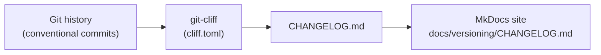
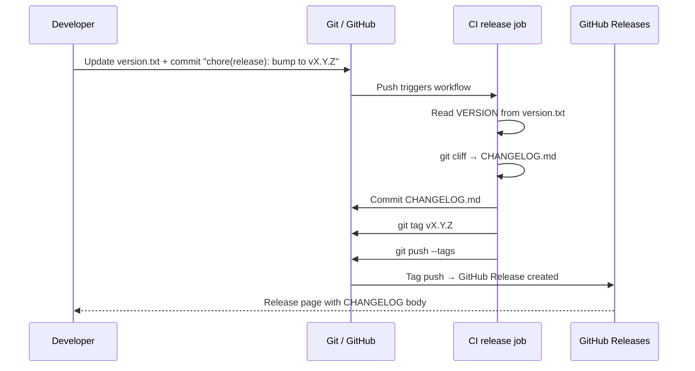

# Versioning & Changelog

This page explains how the deterministic documentation example adopts
**semantic versioning** and an **auto-generated changelog** as first-class
features of the documentation pipeline.

---

## Version Source of Truth

The file `version.txt` in the repository root contains the single canonical
version string.  Every other artefact derives its version from this file —
the CI pipeline, the MkDocs site footer, the Docker image tag, and the
git tag.

```
version.txt
└── CI reads → git tag v<version>
              → CHANGELOG.md generated by git-cliff
              → mkdocs.yml extra.version updated
              → Docker image tagged :v<version>
```

---

## Semantic Versioning Rules

| Change type | Version bump | Commit type |
|-------------|-------------|-------------|
| Breaking change to pipeline API | **MAJOR** (`x.0.0`) | Any commit with `BREAKING CHANGE:` footer |
| New feature, new doc chapter, new policy | **MINOR** (`0.x.0`) | `feat:` |
| Bug fix, doc correction, policy fix | **PATCH** (`0.0.x`) | `fix:`, `docs:` |

---

## Conventional Commits

Commit messages must follow the
[Conventional Commits](https://www.conventionalcommits.org/) specification:

```
<type>(<optional scope>): <description>

[optional body]

[optional footer(s) — e.g. BREAKING CHANGE: ...]
```

**Allowed types** and their changelog section:

| Type | Changelog Section |
|------|------------------|
| `feat` | 🚀 Features |
| `fix` | 🐛 Bug Fixes |
| `docs` | 📖 Documentation |
| `perf` | ⚡ Performance |
| `refactor` | 🔨 Refactoring |
| `style` | 🎨 Style |
| `test` | 🧪 Tests |
| `chore` | 🧹 Chores |
| `ci` | ⚙️ CI/CD |
| `revert` | ⏪ Reverts |

---

## Changelog Generation with git-cliff

[git-cliff](https://github.com/orhun/git-cliff) parses the conventional-commit
history and produces `CHANGELOG.md` deterministically.  The configuration lives
in `cliff.toml`.



### Running Locally

```bash
# Install git-cliff (one-time)
curl -fsSL \
  "https://github.com/orhun/git-cliff/releases/download/v2.4.0/git-cliff-2.4.0-x86_64-unknown-linux-musl.tar.gz" \
  | tar -xz -C /usr/local/bin git-cliff/git-cliff --strip-components=1

# Generate changelog from root of repo
cd example/
git cliff --config cliff.toml --output CHANGELOG.md
```

---

## CI Release Workflow

The `release` job in `docs-pipeline.yml` runs only on pushes to `main`
when `version.txt` has changed:



---

## Traceability

| Artefact | Purpose |
|----------|---------|
| `version.txt` | Single source of truth for version string |
| `cliff.toml` | git-cliff configuration (commit parsing, changelog template) |
| `CHANGELOG.md` | Auto-generated changelog committed to repo |
| ADR | [ADR-0007](../adrs/0007-semantic-versioning-and-changelog.md) |
| Requirements | [V-001, V-002, V-003](../requirements/moscow.md#should-have--versioning--changelog) |
